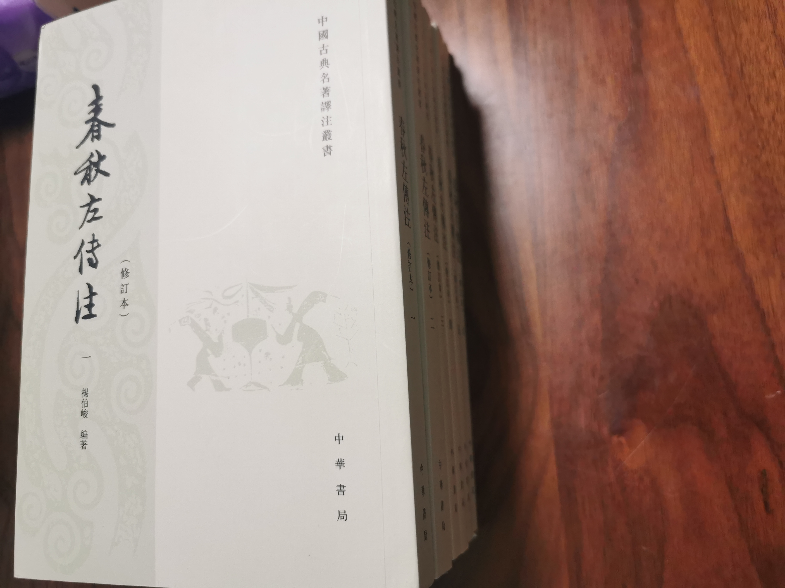
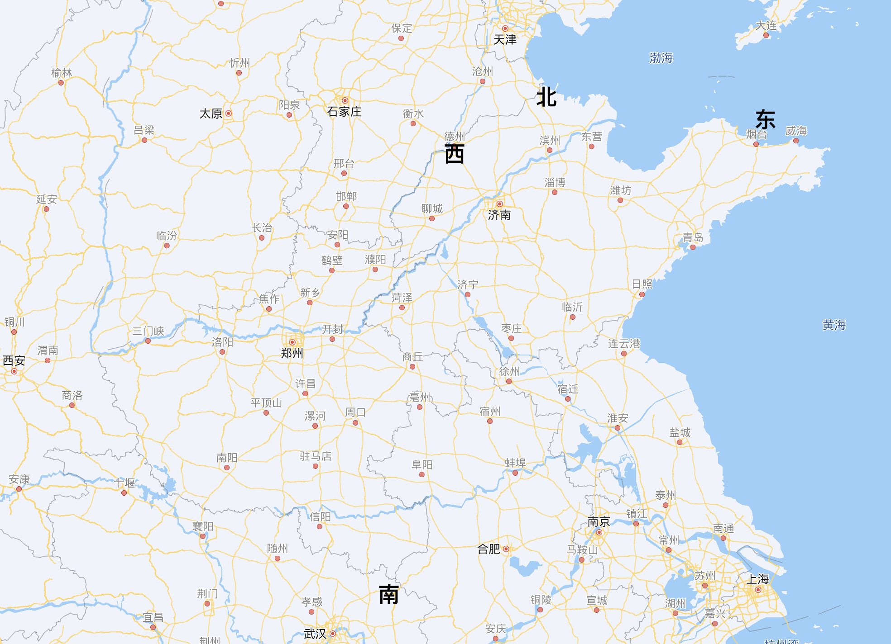
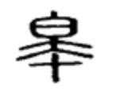

# 《古代汉语》读书笔记（一）

《古代汉语》第一单元选取了十篇《左传》当中的文章。

《左传》是编年体史书，它其实并没有独立的篇章，而是以年为单位进行记事。后来的人们经验性地截取了一些段落出来独立成篇且冠以篇名。《左传》也是儒家经典，位列十三经之一，文中也时有“君子曰”或者“孔子曰”以发表儒家之言。但它本质上还是史书，儒家之言或为后加。它成书于公元前500多年，距今已有2500多年，记录的事情则最早至2700多年前。它可谓是史书之鼻祖，无论是文笔还是记事风格都深深影响了后来的史书。

《古文观止》篇章所选来源最多的也是《左传》，高达34篇，而且位于全书开篇的位置。*王力*的《古代汉语》也沿袭了这一点，将《左传》里的篇章作为第一个单元的文选。

为了尽可能解决疑问，我购买了较为流行的*杨伯峻*所著《春秋左传注》作为参考。

此外，我还在京东读书App上尽可能多地搜集了各种译、注的电子版，以求尽量吸取前人的见解。这些版本列于下表：

| 书名           | 译注者           | 出版社        | 种类        |
| ------------- | ---------------- | ----------- | ----------- |
|《左传（升级版）》|郭丹               |中华书局      |注+译         |
|《左传译注》     |李梦生             |上海古籍出版社 |注+译         |
|《左传（全三册）》|郭丹、程小青、李彬源 |中华书局       |注+译         |
|《左传（全二册）》|杜预              |上海古籍出版社  |注（此即杜著本）|
|《左传全鉴》     |蔡践              |中国纺织出版社  |注+译         |
|《古文观止》     |钟基、李先银、王身刚 |中华书局       |注+译         |

其中中华书局版《左传（全三册）》需要付费购买，因其第一作者与另一本相同（嫌贵），所以我没有购买，只有极少部分阅读权限。

为了保证叙述的完整性，在这里我仍然将所选课文的原文摘抄在其中；每一段课文以【#】开头，即表示课文原文的第#段。

## 【一】郑伯克段于鄢（隱公元年）（公元前722年）

此篇是左传全书第一个可以独立成篇的故事，记录的是鲁隐公元年郑国发生的一件事。它也是《古文观止》全书所选的第一篇。“多行不义必自毙”一语即出自该篇。

他讲述了*郑庄公*骄纵其母亲所宠爱的弟弟，最后又将其打败，使其逃亡至共（gōng）国的故事。这个弟弟名叫*段*，因其逃到共国这个地方，被后人称为*共叔段*。

> 【1】初，鄭武公娶于申，曰武姜。生莊公及共叔段。莊公寤生，驚姜氏，故名曰“寤生”，遂惡之。愛共叔段，欲立之。亟請於武公，公弗許。及莊公即位，爲之請制。公曰：“制，巖邑也，虢叔死焉，佗邑唯命。”請京，使居之，謂之京城大叔。

> 【2】祭仲曰：“都城過百雉，國之害也。先王之制，大都不過參國之一，中五之一，小九之一。今京不度，非制也。君將不堪。”公曰：“姜氏欲之，焉辟害？”對曰：“姜氏何厭之有？不如早爲之所，無使滋蔓，蔓難圖也；蔓草猶不可除，況君之寵弟乎？”公曰：“多行不義，必自斃。子姑待之。”

> 【3】既而大叔命西鄙北鄙貳於己。公子吕曰：“國不堪貳，君將若之何？欲與大叔，臣請事之；若弗與，則請除之。無生民心。”公曰：“**無庸**，將自及。”

“無”通“毋”。我之前一直把“毋”和“勿”这两个字搞混：这两个字意思很相近，都有“不要”的意思，但“毋”读wú，“勿”则读wù。“毋”字所表达的意思更委婉，而“勿”字则更接近禁止。所以，“無庸”通“毋庸”。此亦即“毋庸置疑”的“毋庸”。

> 【4】大叔又收貳以爲己邑，至于廩延。子封曰：“可矣。厚將得衆。”公曰：“不義不暱，厚將崩。”

> 【5】大叔完聚，繕甲兵，具卒乘，將襲**鄭**。夫人將啟之。公聞其期，曰：“可矣！”命子封帥車二百乘以伐**京**。京叛大叔段，段入于**鄢**。公伐諸鄢。五月辛丑，大叔出奔**共**。

读到这里我最大的不解就是*段*的行动轨迹看起来很诡异。

这其中出现了若干地名，列举如下：

| 地名 | 性质        | 今天的位置    | 
| --- | ---------- | ------------ |
| 鄭  | 郑国都城     | 河南新郑市    |
| 京  | *段*之封地   | 河南荥阳市东南 |
| 鄢  | *段*入之地   | 河南鄢陵县境内 |
| 共  | *段*出奔之地 | 河南辉县境内   |

其时礼崩乐坏，诸侯相互侵伐；郑国已经吞并掉了一些周边的国，所以其势力范围已经远远大于新郑一城。

上述地名的具体位置《左传》各版本注释所称皆一致，在《中国历史地图集》上也都能找到对应的位置：

然而这一看就看出奇怪的地方来：

1. 京在郑的东北，鄢在郑的东南。郑伐京，*段*竟然直接越过了郑逃到了鄢。古人生产力不高，都是逐水而居，沿水而行。京、郑、鄢几乎是居于同一条河边，想必从京逃到鄢的时候也很难不沿着图中的洧（wěi）水而下。那么*段*是如何躲过郑的攻伐的呢？而且*段*为何会**面向敌人来的方向逃跑**呢？这很难说通。
2. 同样的道理，郑从东北而来伐鄢，*段*又为何再次相向而行，往北逃往共呢？要知道郑国的势力范围很大，从文中所提及的几个地点来看，西北方向可达虎牢（制）。正西方向可达颍水的最上游、嵩山以南的颍水谷地。东应该能到氾（fán）水以南的地区。那么这次*段*又几乎跨越了整个郑国的中心地带，逃到了共。这同样也说不通。

我能想到的有两个解释，但都不是满意的答案。

1. 这几个地点的考证其中有问题。比如鄢的位置可能有误，我猜测它可能在京和共之间，而不是在郑的东南位置。但这种可能性其实并不大。要知道鄢这个地方都过了2700多年了，现在几乎还叫做鄢！（即今鄢陵县。）
2. 彼时古人生产力低，于是打仗也像过家家，也许就跟今天的两村村民械斗差不多。段带着他的人使劲跑，*郑庄公*也许没有足够的兵力能够围堵住他吧。

> 【6】遂寘姜氏于城潁，而誓之曰：“不及黄泉，無相見也。”——既而悔之。

> 【7】潁考叔爲潁谷封人，聞之，有獻於公。公賜之食。食舍肉。公問之，對曰：“小人有母，皆嘗小人之食矣，未嘗君之羹。請以遺之。”公曰：“爾有母遺，繄我獨無！”潁考叔曰：“敢問何謂也？”公語之故，且告之悔。對曰：“君何患焉？若**闕**地及泉，隧而相見，其誰曰不然？”公從之。公入而賦：“大隧之中，其樂也融融。”姜出而賦：“大隧之外，其樂也洩洩。”遂爲母子如初。

“闕”字有三个读音：què、quē、jué。在现代这个字只有què这个读音了，是它的本义。在古代常见读quē，同“缺”。此处应当读jué，同“掘”。

> 【8】君子曰：潁考叔，純孝也。愛其母，施及莊公。詩曰：“孝子不匱，永錫爾類。”其是之謂乎？

《左传》对这件事的描述可谓相当精彩，不愧为诸多文选的首篇。全篇的最后还赞扬了郑国的大臣*颍考叔*用孝心感化了*郑庄公*，使他与母亲在“黄泉之下”和好如初的事迹。*颍考叔*也是能臣，可惜后来他在率领郑国的军队讨伐另一个国家时被其副将背刺而死。郑国最后也逐渐衰亡，到了战国时代不久就不复存在了。

## 【二】齐桓公伐楚（僖公四年）（公元前656年）

这一篇课文讲述的是*齐桓公*联合多个诸侯国一起向南讨伐楚国，被楚国的两位使者游说，最后订立盟约的故事。

第一位楚国的使者问*齐桓公*：“我楚国和你齐国**风马牛不相及**，为什么来打我？”原文是这么写的：

> 【1】四年，春，齊侯以諸侯之師侵蔡。蔡潰，遂伐楚。楚子使與師言曰：“君處北海，寡人處南海，唯是**風馬牛不相及**也。不虞君之涉吾地也，何故？”管仲對曰：“昔召康公命我先君大公曰：‘五侯九伯，女實征之，以夾輔周室。’賜我先君**履**：東至于海，西至于河，南至于**穆陵**，北至于無棣。爾貢包茅不入，王祭不共，無以縮酒，寡人是徵；昭王南征而不復，寡人是問。”對曰：“貢之不入，寡君之罪也，敢不共給？昭王之不復，君其問諸水濱。”

”风马牛不相及“到如今已是成语，然而到底啥叫**风马牛**不相及？风是指什么？和马、牛又有啥关系呢？《古代汉语》的注释是这样的：

> 马牛牝牡相诱也不相及（依*孔颖达*说）。**风**，放，指牝牡相诱。这是譬喻两国相距甚远，一向不相干。

查字典可知“牝”（pìn）是指母牛，泛指雌性牲畜。“牡”则是指雄性鸟兽。那么难道这句话的意思是母牛和公马相互勾引，最终也无法搞到一块去？

我想这个解释*王力*先生估计也不是特别认同，所以才仅仅是说“**依***孔颖达*说”。

我翻阅《春秋左传注》，*杨伯峻*也是依从此说。其主要的依据是：

> 尚书费誓：“马牛其风”

翻阅上海古籍出版社的《左传（全二册）》，其解释为：

> 牛马风逸，盖莫界之微事，故以取喻。

翻阅中华书局*郭丹*所著《左传（升级版）》，其译文为：

> 就是牛马发情，也不能跑到一起呀。

所以诸多译注都是同一说。但是我总觉牵强。

翻阅《学生实用：古汉语常用字字典》中“风”字的解释：

> ⑦ <动>动物逃逸走失。《左传·僖公四年》：“君处北海，寡人处南海，唯是～马牛不相及也。”

这个意义正是用来解释这句话的。于是这句话的意思大约是：我楚国的马往北放走了，你齐国的牛往南放走了，但是齐楚离得那么远，它俩怎么走也碰不着面呀。

感觉此种说法没那么牵强，因为对“风”字的解释没有引申出来那么绕的意思。

我又查阅了《说文解字》，其“风”字的解释并没有带来什么新的信息，和今天的刮大风的风无异。

总而言之，在这个问题上我更倾向于《学生实用：古汉语常用字字典》的解释。

至于后面*管仲*的这一段回答，**我读后有两个疑问**。

**第一个问题**，穆陵是指哪里？

这个回答的第一句，*管仲*的意思是当年召（shào）康公给了我们齐国的先祖齐太公（即著名的姜子牙）很大的权限；只要看哪个诸侯对周天子不利，我们齐国就可以征讨他。

这个回答的第二句，一般的版本会这么解释：“并赐予我们先君讨伐的范围：东到大海，西到黄河，南到穆陵，北到无棣。”

《古代汉语》里此处“履”字的注释是这样的：

> 履，践踏，这里指足迹所践踏的地方，即齐国所征伐的范围。

目前我看到的其他版本的《左传》注释几乎都是类似的说法。

这句话里东西南北四至中的三个地名都是毫无争议的。**海**即大海，今天的学名叫黄海。**河**即黄河，古代黄河称河水；但在春秋时代的流向**与今天不同**，大致从郑州北部开始向北偏东流，在今天的天津附近入渤海。**无棣**即今天的无棣县，位于山东省的最北端与河北交界处，因无棣河而得名。（令我不得不感叹的是，这地方都过了2600多年竟然还叫这个名字，一字不改。）

但是这句话中所提到**穆陵**是个什么地方？对于这个问题，诸多版本的注释就分为了两派。

一派认为是今山东省临朐（qú）县的穆陵关。《古代汉语》遵从此说。

另一派认为是今湖北省麻城西北一带与河南省交界处，该地也叫穆陵关。*杨伯峻*的《春秋左传注》主张这个说法，其理由是：管仲既然要声明自己有征讨楚地的权利，所以如果征讨的范围向南只到山东的那个穆陵关的话，那就自相矛盾了，那就正符合了楚国的使者所讲的“风马牛不相及”了。而湖北的穆陵关深入楚境，所以我齐国有权征讨。应当取湖北的穆陵关为正解。

初读《古代汉语》的注释，我也觉得山东临朐县远不及此时齐桓公所率的军队到达的地方，管仲到底是在说什么胡话呢？所以当我翻到*杨伯峻*的《春秋左传注》对这一问题的解释时，我也眼前一亮。但是细想下来，我又很快否定了*杨伯峻*的这一观点。为了说明这一问题，我们可以看一下春秋时代齐国的山东的地图：

东到大海，西到黄河，北到无棣，这三者都是当时齐国国土所至，都还在今天的山东省境内。那么有什么理由在同一句话里，往南就能跑到远在千里的湖北去了呢？看看这几个地方画在今天的地图上是什么样，就可以知道这种说法有多违反直觉了。

所以我相信穆陵就是指今天的山东省临朐县的穆陵关。*杨伯峻*的说法才是牵强附会之说。

既然这里的东西南北所至都在指齐国封地的范围，那么**问题到底出在哪里呢？**

我不得不怀疑是不是承上启下的这句话的解释出了问题：**賜我先君履**。于是我又查询《学生实用：古汉语常用字字典》中关于**履**字的解释：

> ① <名>鞋。

> ④ <名>疆界，领土。《左传·僖公四年》：“赐我先君～：东至于海，西至于河，南至于穆陵，北至于无棣。”

**履**字的本义是鞋子，引申出踩、踏的意思，最后引申出这里的疆界、领土之意。所以《学生实用：古汉语常用字字典》的解释竟然与我所猜测的完全吻合。**賜我先君履**并不需要过度解释成“给我先君划定可以征伐的范围”，而可以只是说“赐予我齐国先君的疆界”。所以穆陵也必然是山东省临朐县的穆陵关。当时齐国与楚国中间也隔着鲁国、宋国、郑国等国家，确是风马牛不相及。

然而，此处管仲的逻辑到底是什么呢？我猜测，此处管仲只是在完整地陈述当初齐国立国的时候的情形。一方面被给予了征伐其他诸侯的权力，另一方面被正式册封了疆域。真正能来拿当作伐楚借口的，正是征伐其他诸侯的权力。而征伐其他诸侯这一权力，并不看诸侯国所在是哪里！

*郭丹*所著《左传（升级版）》介绍该篇的背景时写到：

> 南方的楚国国力日益强盛，连年出兵攻打郑国，企图入主中原。为了阻遏楚国的北进，齐桓公乃于鲁僖公四年（前656）亲自率领齐、鲁、宋、陈、卫、郑、许、曹八国诸侯之师南下伐楚。楚国毫不示弱，与之进行了争锋相对的外交斗争，最后齐、楚订盟于召陵。齐桓公这次出兵虽未与楚作战，但却打击了楚国北进的锋芒，暂时消除了楚国对中原诸国的威胁。本篇记述了此次齐楚斗争的全过程，行文起伏跌宕、文辞渊懿雅丽；其中所记之行人辞令委婉含蓄、刚柔得体而言简意深，为春秋时期行人辞令典范之一。

当时*齐桓公*称霸，尊王攘夷。这次讨伐楚国，正是体现其尊王攘夷的主张。而他能贯彻这一主张，让诸侯跟随的底气，也大概来自于齐太公所获取的征讨其他诸侯的权力，而非来自于其领土。

翻阅《史记·齐太公世家第二》，其中有一段是这么写的：

> 大公至国，修政，因其俗，简其礼，通商工之业，便鱼盐之利，而人民多归齐，齐为大国。及周成王少时，管蔡作乱，淮夷畔周，乃使召康公命太公曰：“东至海，西至河，南至穆陵，北至无棣，五侯九伯，实得征之。”齐由此得征伐，为大国。都营丘。

我的理解是，当时管、蔡作乱，淮夷叛周，周成王需要帮助，所以正式册封太公所得的土地，并且赐予征伐之权，从而引以为援手，终得以平叛。

综上所引，管仲这句话也就显得不那么无理取闹了。

**第二个问题**，管仲为何自称“寡人”？

在百度上搜索“寡人”一词，其解释简单明了：古代君主、诸侯王的自称。

首先，此处*管仲*所说寡人，难道是指自己吗？答案是肯定的。

本篇前一段楚国使者的言论里也有“**寡人**处南海”一句，但那一句相当于是使者替楚国国君带话，所以指的是楚国国君本人。在后一段里，楚国的使者就称其国君为**寡君**了：

> 對曰：“貢之不入，**寡君**之罪也，敢不共給？昭王之不復，君其問諸水濱。”

所以，在此处，*管仲*所称的寡人必然是指的自己，而不是指自己的国君*齐桓公*。因为如果指*齐桓公*，按《左传》的风格用“寡君”一词指代即可。

有趣的是，在后面一段中*齐桓公*自称为“**不穀（gǔ）**”。不穀也是诸侯常见的自称，例如《古代汉语》第一单元第八篇文选《楚歸晉知罃》当中的楚共王即自称不穀。

所以在这里并没有出现管仲与齐桓公都自称寡人的尴尬场面。我们可以猜测当时在齐国大臣是可以自称寡人的。而国君则习惯自称不穀。可能就有点像“朕”字的演变，从人皆可称朕演变到秦始皇专属。

为了验证这个想法，我搜索了《左传》的TXT文档的“寡人”一词，大致扫过许多带有“寡人”一词的语句，但其用法无一例外均是诸侯的自称。

值得一提的是，*李梦生*所著《左传译注》将“管仲對曰”译成是“管仲代表桓公回答说”，从而绕过了这个问题。这也从侧面反映*李梦生*也是考虑到了*管仲*用寡人自称似有不妥。

另外，在知乎上也有人提了同样的问题。[网友胡斐的回答](https://www.zhihu.com/question/20846042)也不无道理：

> 按照语境来说，当时管仲是代表齐国去与楚国使节谈判，管仲用寡人自称在外交上显得更加正式大气。试想下如果用“臣”，“余”，“鄙人”这些都显得有点卑谦了。

这个问题我目前仍不能得到满意的解答。

> 【2】師進，次于陘。

> 【3】夏，楚子使屈完如師。師退，次于召陵。

> 【4】齊侯陳諸侯之師，與屈完乘而觀之。齊侯曰：“豈不穀是爲？先君之好是繼。與不穀同好，如何？”對曰：“君惠徼福於敝邑之社稷，辱收寡君。寡君之願也。”齊侯曰：“以此衆戰，誰能禦之？以此攻城，何城不克？”對曰：“君若以德綏諸侯，誰敢不服？君若以力，楚國方城以爲城，漢水以爲池。雖衆，無所用之。”

> 【5】屈完及諸侯盟。

## 【三】宫之奇諫假道（僖公五年）（公元前655年）

这篇课文讲述的是成语“假道伐虢”背后的故事。晋国第二次借道虞国以讨伐西虢国，其目的是彻底灭亡西虢国。虞国大臣*宫之奇*谏言虞国国君不要给晋国借道，因为晋国很可能会顺道就把虞国也吞并了。可惜虞国国君不听从谏言，因为蝇头小利而答应了晋国的要求，最终招致灭亡。

> 【1】晉侯復假道於虞以伐虢。宫之奇諫曰：“虢，虞之表也。虢亡，虞必從之。晉不可啟，寇不可翫。一之**謂**甚，其可再乎？諺所謂‘**輔車相依**，脣亡齒寒’者，其虞虢之謂也。”

其中有一句“一之謂甚，其可再乎？”，关于“謂”字课文注释是这样的：

> 謂，通“爲”（依*王念孫*説）。

我理解“一之謂甚”可以说成是“第一次**可以说**是很过分了”。这个謂字明明意思很浅白，可以很容易说通，为什么要通“为”字呢？

“謂”在左传的文章里也极其常见，在第一单元里也被当作常用字收录：

> （一）对【某人】说。《左传·僖公三十二年》：“公使～之曰。”

> （二）叫，叫做，认为。

> （三）评论【人物】。

> （四）通“为”。《左传·僖公五年》：“一之～甚，其可再乎？”

所以，《古代汉语》认为这里取第四个意思。然而第二个意思也是很说得通的，为何一定要取第四个意思呢？

这次我先求助于《学生实用：古汉语常用字字典》。结果它的观点与《古代汉语》基本一致：
> ② 通“为（wéi）”。<动>算是，算作。《左传·僖公五年》：“一之～甚，其可再乎？”

这么解释当然没有问题，只是为何这么常用的一字会被用来通假另外一个十分常用的字呢？**通**，表示通假字，是指“被广为接受的写错或印错的字”通“作者本来要写的字”。当然，繁体的“爲”确实笔画比较多，不太好写。可是“謂”笔画也很多啊。

*杨伯峻*的《春秋左传注》对这个字没有注释。上海古籍出版社的版本对此没有注释。*郭丹*的版本对此也没有解释。

查询《说文解字》中謂的释义：

> 謂，报也。从言，胃声。段玉裁《说文解字注》：“凡论人论事得其实谓之报。”

所以，这个字的本义就是**评论人或者事**。一之謂甚，即第一次**论**起来已经是很过分了。

我总觉得，如果一个字放在句中依其本义就能说通的话，那肯定是先遵其本义。关于这个謂通“爲”的疑问，目前我还没有找到第二种说法。也许*王力*也对此略有疑问，所以才说是“**依***王念孫*説”吧。我姑且认为这个字**不应当做通假字**。

此段谏言还产生了一个著名的成语：唇亡齿寒。然而它的前面还有另外一句话：**辅车相依**。《古代汉语》对这个词的解释也让我颇为迷惑：

> 輔，面頰。車，牙牀骨。

车难道不就是车么？难道车的本义是牙牀骨？翻阅《学生实用：古汉语常用字字典》“车”的释义，它竟然也用“牙床”来解释这句话中车的意思。

只不过车的本义必然就是我们常说的车，因为它是一个太典型了的象形字：車就是两个轮子串了一个车厢。它不可能还有别的意义。直觉告诉我，这里用牙床来解释车，很可能是前人牵强附会之说。

查阅《学生实用：古汉语常用字字典》中“辅”字的解释：

> ① <名>车轮外旁的两条直木，用以增强轮辐的承受力。《诗经·小雅·正月》：“其车既载，乃弃尔～。”

> ② <名>面颊。《周易·咸》：“上六：咸其～、颊、舌。”

还是那句话，用其本义就能解释得很清楚的一句话，为什么要用其引申义呢？更何况，将车解释为牙牀骨，**我目前并未见到它例**。想必是前人依“辅”字的引申义附会而来，因为紧接着但后一句“唇亡齿寒”也正好是用嘴巴里的器官来作为比喻的。

*杨伯峻*的《春秋左传注》对这一段的解释与我的理解一致。他说：

> 輔，車兩旁之板。大車載物必用輔支持，故輔與車有相依之關係。杜注解輔爲面頰，是以輔爲（面甫），誤...足見先秦皆不以輔爲（面甫）...

此处（面甫）乃是一字，“面”为部首“甫”为声旁，在这里打字打不出来。这里也认为辅车相依、唇亡齿寒，当是同一种关系的两个例子的并列。“杜注”即晋代*杜预*的《春秋左氏经传集解》。杜预先用面颊来解释辅字，然后用牙床来附会车字，这种解释实在是有些不可理喻了。

> 【2】公曰：“晉，吾宗也，豈害我哉？”對曰：“大伯虞仲，大王之昭也。大伯不從，是以不嗣。虢仲虢叔，王季之穆也。爲文王卿士，勳在王室，藏於盟府。將虢是滅，何愛於虞？且虞能親於桓莊乎，**其愛之也**？桓莊之族何罪，而以爲戮？不唯偪乎？親以寵偪，猶尚害之，況以國乎？”

在第2段中，虞国国君认为晋虞同宗，晋不会害虞。*宫之奇*回答说虢国跟晋国也是同宗，按世代关系来算甚至比虞更亲，所以虞国国君纯粹是在自欺欺人罢了。

“且虞能親於桓莊乎”这一句之后的断句争议相当大。《古代汉语》认为“且虞能親於桓莊乎，其愛之也？”乃是倒装句的结构，相当于“且其愛虞能親於桓莊乎”。我在多次默写过这一段之后也接受了这个解释，认为这样断句较为通顺。虽然这种倒装法跟我们现代汉语差异较大，但不影响后面一句的断句与解释。

*杨伯峻*的《春秋左传注》断句如下：

> 將虢是滅，何愛於虞？且虞能親於桓、莊乎？**其愛之也**，桓、莊之族何罪？而以爲戮，不唯偪乎？親以寵偪，猶尚害之，況以國乎？

可以看到，“其愛之也”是这一段断句的关键之处。*杨伯峻*是这么解释的：

> 之指桓、莊之族，此句引起下文，前人多不了。

至于怎么“引起下文”，**他没说**。

我是横看竖看都没看出来“其愛之也，桓莊之族何罪？”这一句当怎么说得通，“其愛之也”怎么就引起了“桓莊之族何罪”这个下文？

然后我翻阅了其他资料。以*郭丹*所著《左传（升级版）》为例，他与*杨伯峻*的断句一致，把“其愛之也”划给了后一句。但是他的译文却是这样写的：

> 现在，晋国将要灭掉虢国了，对于虞国又有什么舍不得呢？再说，虞国能比桓叔和庄伯更亲近晋侯吗？桓叔、庄伯两族有什么罪过，晋侯却把他们杀掉，不就是因为晋侯感觉到他们的威胁吗？亲近而且受宠，一旦威胁到晋侯，都尚且被杀害，更何况一个国家呢？

在这里，“其愛之也”这句的并没有被翻译，被丢掉了！

反而是同样遵循这一断句的《左传全鉴》的翻译稍微有一点点说得通：

> 晋国都想要灭掉虢国，他对虞国又有什么不舍的呢？况且（对于晋献公来说）虞国还能比桓叔、庄伯更加亲近吗？如果晋献公真的爱惜同宗的人，桓叔、庄伯的后代又有什么罪？他们却被全部杀掉，难道不是因为威胁到了晋献公吗？亲近、得宠的人一旦威胁到晋献公，（晋献公）尚且还能够将他们杀害，更何况一个国家呢？

可以看到，“其愛之也”被翻译为“如果晋献公真的爱惜同宗的人”，与后一句的关系略显勉强。

因为这一篇同样收录在《古文观止》里，所以我也翻阅了中华书局但全注全译本《古文观止》。它的断句是这样的：

> 將虢是滅，何愛於虞？且虞能親於桓、莊乎？**其愛之也**？桓、莊之族何罪？而以爲戮，不唯偪乎？親以寵逼，猶尚害之，況以國乎？

这里“其愛之也”独立成句，附以问号。它的翻译是这样的：

> 晋国要灭掉虢国，对虞国又有什么爱惜的？况且虞国能比曲沃桓叔、庄伯与他的关系更亲近吗？他爱惜桓叔、庄伯吗？桓叔、庄伯的家族有什么罪过而把他们杀了，不就是因为有威胁吗？亲族而以宠势相威胁，尚且杀害了他们，何况其他国家呢？

“其愛之也”被译作“他爱惜桓叔、庄伯吗”。这种说法我最后才看到，感觉有可取之处。只不过，虽然“也”字可以带有疑问语气，但是一般只有句中有疑问代词或者疑问副词时这个疑问语气才成立。此句中的“其”字并非疑问代词，所以它不似疑问句。

最后，上海古籍出版社的《左传（全二册）》在此处的断句与《古代汉语》相同。我目前也最赞同这样的断句。

> 【3】公曰：“吾享祀豐絜，神必據我。”對曰：“臣聞之：鬼神非人實親，惟德是依。故周書曰：‘皇天無親，惟德是輔’。又曰：‘黍稷非馨，明德惟馨’。又曰：‘民不易物，惟德繄物’。如是，**則非德民不和**，神不享矣。神所馮依，将在德矣。若晉取虞，而明德以薦馨香，神其吐之乎？”

这一段，虞国国君说他祭祀虔诚，神会帮他的。宫之奇引用了一大堆《周书》（即《尚书》）中的语句来驳斥这个说法。

其中的这句“如是，則非德民不和，神不享矣”课文中并没有注释。“如是”乃是承上启下，发起评论之意。而评论的对象则是前面三句引自《周书》中的话语。最后一句话“民不易物，惟德繄物”的大意是：

> 人们拿来祭祀的东西并不改变（祭品是相同的），【但是】只有有德的人的祭品才算是【真正的】祭品。

那么，后面这句发起评论的话是什么意思呢？“神不享矣”很好理解，意思是神就不来享用祭品了。“則非德民不和”是啥意思？是没有德就不“人和”吗？

翻阅《左传》的其他版本，几乎都将这句断成了“如是，**則非德，民不和**，神不享矣”，但都没有注释。于是我只能参考全译本的译文了。这些译文摘录如下：

> 这样说来，没有德行，人民就不和，神灵也不肯享用它的祭品了。

> 如此说来，如若没有美德，百姓就不会和顺，神明也不会享用祭品。

> 像这样，那么没有道德，百姓就不和，神就不来享用了。

唯有*郭丹*著《左传（升级版）》对此翻译有不同：

> 像这样，那么，不是有德之人，则百姓不知，祭品再丰洁，神也不会享用的。

然而这里的**知**字更像是**和**字的打印错误。

所以几乎所有的翻译，都是一个意思。然而“没有德行”和“人民不和”有什么关系呢？“人民不和”又和“神不享矣”是什么关系呢？一切的关键在于这个**和**字怎么理解。然而翻遍字典，和字的意思和今天的意思几乎完全一致，所以这里我们只能理解成“人民就不和”。

这个问题我没有找到答案，这样的翻译出来的意思让人总感觉逻辑性不够，但我姑且依之吧。

>【4】弗聽，許晉使。宫之奇以其族行，曰：“虞不臘矣。在此行也，晉不更舉矣。”

>【5】冬，十二月丙子朔，晉滅虢。虢公醜奔京師。師還，館于虞。遂襲虞，滅之。

## 【四】燭之武退秦師（僖公三十年）（公元前630年）

此篇乃高中课文所选。烛之武说服秦穆公的话语逻辑严密，极其精彩，也千古流传。

>【1】晉侯秦伯圍鄭，以其無禮於晉，且貳於楚也。晉軍函陵，秦軍氾南。佚之狐言於鄭伯曰：“國危矣！若使燭之武見秦君，師必退。”公從之。辭曰：“臣之壯也，猶不如人。今老矣，無能爲也已。”公曰：“吾不能早用子，今急而求子，是寡人之過也。然鄭亡，子亦有不利焉！”許之。

此处*郑伯*的话似乎有威胁的意味。

>【2】夜縋而出，見秦伯曰：“秦晉圍鄭，鄭既知亡矣。若亡鄭而有益於君，敢以煩執事？越國以鄙遠，君知其難也；焉用亡鄭以陪鄰？鄰之厚，君之薄也。若舍鄭以爲東道主，行李之往來，共其乏困，君亦無所害。且君嘗爲晋君賜矣，許君焦、瑕，朝濟而夕設版焉，君之所知也。夫晉何厭之有？既東封鄭，又欲肆其西封；若不闕秦，將焉取之？闕秦以利晉，唯君圖之。”

>【3】秦伯説，與鄭人盟。使杞子、逢孫、楊孫戍之，乃還。

>【4】子犯請擊之。公曰：“不可。微夫人之力不及此。因人之力而敝之，不仁；失其所與，不知；以亂易整，不武。吾其還也。”亦去之。

我读完此文，没有什么疑问。它是这十篇文选当中唯一一篇让我读完没有疑问的，也难怪我们高中的课文都选择它作为《左传》的代表作。当然，高中课文中还有另外一篇《曹刿论战》也是出自《左传》。

## 【五】蹇叔哭师（僖公三十二年）（公元前628年）

> 【1】冬，晉文公卒。庚辰，將殯**于**曲沃。出絳，柩有聲如牛。卜偃使大夫拜，曰：“君命大事，將有西師過軼我。擊之，必大捷焉。”

在前一篇课文中，*秦穆公*听从了烛之武“越國以鄙遠，君知其難也”的劝解，放弃了攻打郑国。然而两年后*晋文公*死了，秦穆公竟然又想趁这个时机去独自吞并郑国。*蹇（jiǎn）叔*是秦国的元老，劝*秦穆公*不要发兵，其理由也是类似的。

> 【2】杞子自鄭使告**于**秦曰：“鄭人使我掌其北門之管。若潛師以來，國可得也。”穆公訪諸蹇叔。蹇叔曰：“勞師以襲遠，非所聞也。師勞力竭，遠主備之，無乃不可乎？師之所爲，鄭必知之。勤而無所，必有悖心。且行千里，其誰不知？”公辭焉。召孟明、西乞、白乙，使出師**於**東門之外。蹇叔哭之，曰：“孟子，吾見師之出而不見其入也！”公使謂之曰：“爾何知！中壽，爾墓之木拱矣！”

为了攻打郑国，甚至要偷偷地越过晋国的势力范围，*秦穆公*也真是昏聩了。*蹇叔*在秦军发兵之日送而哭之。后来果然秦军没有实现战略目标，仅仅灭了滑国而返，在殽山遭受晋军阻击，几乎全军覆没。

在前面四篇课文中，“于”和“於”都有使用。与我在学习《古代汉语》之前的认知不同的是，“于”字并非简单地是“於”字的简化字。他们俩有似乎明确的分工：

**“于”字后面必接地名**，表示在某地做了什么，或者到了哪里。例如“郑伯克段于鄢”、“至于廩延”、遂寘姜氏于城潁、“南至于穆陵”等。

**“於”字则担当了现代汉语里于字的所有其他用法**，比如“向某人做什么”、表示比较关系等。例如“亟請於武公”、“何愛於虞”、“且虞能親於桓莊乎”等。

然而在《蹇叔哭师》一文里，这个原则却最终被彻底打乱了。按顺序列举文中出现的“于”和“於”如下：

> 庚辰，將殯**于**曲沃。

曲沃是地名，这句**没毛病**。

> 杞子自鄭使告**于**秦曰：“...”

这句看起来就有问题。各版本的译文基本上是这样写的：“杞子从郑国派人告诉秦国/秦穆公说”。此处秦国或者秦穆公乃是告知的对象，而非地名，却用了“于”字。当然我们可以认为**此处秦仍然可做地名**，于是这句话应当翻译为：杞子从郑国派使者到了秦国报告说。

> 召孟明、西乞、白乙，使出師**於**東門之外。

东门可视作地名，应当跟随“于”字才对，然而这里用了“於”字。当然，我们仍然可以理解成秦军是向着东门外发兵。**仍然能解**。

> 晉人禦師必**於**殽。

殽是地名。这里彻底打破了这个规则，**怎么圆都圆不回来了**。

当然呢，于和於的混淆最终不可避免，到了当代已经没有会去人关心这两个字的区别了。我也觉得，现在说起这个问题来有点像“回字的四种写法”那般可笑。

此外，翻阅《说文解字》，竟然查不到“於”这个字，而“于”和“亏”竟然是同一个字。继续深入了解下去的话，超出了我的学习范围，我就此打住。

> 【3】蹇叔之子與師，哭而送之，曰：“晉人禦師必**於**殽。殽有二陵焉：其南陵，夏后**皋**之墓也；其北陵，文王之所辟風雨也。必死是間，余收爾骨焉。”

没想到读到这一段我又揣摩起“回字的四种写法”这类问题。

《古代汉语》一书纸上写的其实并不是“皋”字，不是上“**白**”下“本”而是上“**自**”下“本”。查看平装版PDF电子档上写的则是“臯”，与手里的纸质精装版也有所不同。这里让我疑惑了好久，因为我每次默写课文的时候需要把每个字一笔一画写出来，我不能写错别字。然而一开始大多数时候我写的都是“皋”字，后来仔细看才发现我少写了一笔。

想必这些都是同一个字在字体演变过程中的分支而已。翻阅《说文解字》，可以看到皋字的小篆字体为：

所以隶书演变成“皋”或者“皐”都是合情合理的。然而“臯”又是怎么回事呢？会不会这个字只是用作夏后皋的名字呢？查遍线上线下的资料，我至今没有得到答案。

> 【4】秦師遂東。

## 【六】晉靈公不君（宣公二年）（公元前607年）

*晋灵公*乃是有名的昏君。当初他被立为国君时作为正卿的*赵盾*（又称*宣子*）就不同意。后来当上国君后他随意杀人，*士季*、*赵盾*劝谏他都不听从。

> 【1】晉靈公不君，厚斂以彫牆。從臺上彈人，而觀其辟丸也。宰夫胹熊蹯不孰，殺之，寘諸畚，使婦人載以過朝。趙盾、士季見其手，問其故而患之。將諫，士季曰：“諫而不入，則莫之繼也。會請先，不入，則子繼之。”三進及溜，而後視之，曰：“吾知所過矣，将改之。”稽首而對曰：“人誰無過？過而能改，善莫大焉。詩曰：‘靡不有初，鮮克有終。’夫如是，則能補過者鲜矣。**君能有終，則社稷之固也**，豈唯羣臣賴之？又曰：‘**袞職有闕**，惟仲山甫補之。’能補過也。君能補過，袞不廢矣。”

这第1段讲*晋灵公*的劣迹和大臣*士季*初谏。其中引用了“靡不有初，鲜克有终”这句有名的诗句，恰好勉励初入此门的学子：学习需要有始有终。

“君能有終，則社稷之固也”一句，我读来读去总觉不通顺。一般来说，社稷之固意思是社稷稳固，之用来将整句名词化，从而可以衔接上下文。如果这句改成“君能有終，則**爲**社稷之固也”，或者改成“君能有終，則社稷固也”，都通。但唯独目前这个状态着实不通。目前未见有人指出这一点。

而最难理解的在最后这一句。“袞職有闕，惟仲山甫補之”，同样也是《诗经》中的诗句。袞是指天子或者国君的衣服，《古代汉语》解释为“这里指天子”。而職（职）字被解释为职责，所以这句话通常被翻译为：

> 天子的职责有所缺失，只有仲山甫能够为他弥补。

然而这么一翻译，紧跟着的这句话，“能補過也”，好像就变成了一句废话：仲山甫能够弥补周天子职责的缺失，是能够弥补过错呀。

更何况这之后又紧跟了一句“君能補過，袞不廢矣”。这里似乎写得失去了逻辑，变得啰嗦而不知所谓。

事实上联系前文，我们可以看到*士季*是在向*晋灵公*通过讲解诗句的办法来说明道理。所以前有：

> 詩曰：‘靡不有初，鮮克有終。’夫如是，則能補過者鲜矣。

后有：

> 又曰：‘袞職有闕，惟仲山甫補之。’能補過也。

不论是“夫如是，則能補過者鲜矣”还是“能補過也”都应当是对前面这句引用的诗句的讲解和评论。所以我觉得“袞職有闕”不应当被翻译成“天子的职责有所缺失”或“天子有了过错”，而似乎应当被翻译成“天子的衣服有了缺损，只有仲山甫能够补好它。”而**补衣服就是比喻弥补过错**——这正是紧跟着的这句“能補過也”所要表达的意思。最后再说国君您能弥补过错，您的衣服就不会被损坏了——意思是指您的位子就不会被夺走了。这里是把好听的不好听的一起说了，带有威胁的意味在里面。

我觉得以上这个逻辑可以很清楚地讲通这几句话了。然而还有一个遗留的问题，这个“職”字又当何解呢？如果把袞直译为衣服，而非代指天子，那么袞職是指什么呢？查阅“職”字在《说文解字》中的解释：

> 職，记微也。从耳。（職，记住微妙的事物。）

这个本义对我们解决这个问题看起来没有什么帮助。那么会不会这里本来是“戠”或这以戠为声旁的其它字呢？比如是“幟”或者“識”？表示旗帜之义？遗憾的是，翻了大量资料我仍然没有找到答案。所以我也没有信心说我的理解就是对的。

> 【2】猶不改，宣子驟諫。公患之，使鉏麑賊之。晨往，寝門闢矣。盛服將朝，尚早，坐而假寐。麑退，歎而言曰：“不忘恭敬，**民之主**也。賊民之主，不忠；棄君之命，不信。有一如此，不如死也。”觸槐而死。

此处出现了一个有趣的词语，“民之主”。一般的版本解释这个词为民众的领袖。查阅《说文解字》后方得知主的本义是灯上明亮的火焰。

> 主，镫中火主也。（主，灯中的火柱子）

毫无疑问，这是个象形字。主字头上那一点正是像火焰。《学生实用：古汉语常用字字典》中主字的第一个释义解释为“首领，为首的人”。所以“民之主”的翻译为“民众的领袖”是没有太大问题的。然而根据主字的本义，我觉得也可以翻译为“民众的表率”。而且这样说起来似乎意义更加顺畅一点。我们常打趣说美国是“灯塔国”，那么主字用于形容能够照亮他人/他物的东西，似乎也是贴切的。

> 【3】秋九月，晉侯飲趙盾酒，伏甲将**攻**之。其右提彌明知之，趨登曰：“臣侍君宴，過三爵，非禮也。”遂扶以下。公嗾夫獒焉。明搏而殺之。盾曰：“棄人用犬，雖猛何爲？”鬭且出。提彌明死之。

> 【4】初，**宣子**田於首山，舍于翳桑。見**靈輒**餓，問其病。曰：“不食三日矣。”食之。舍其半。問之。曰：“宦三年矣，未知母之存否；今近矣，請以遺之。”使盡之，而爲之簞食與肉，寘諸橐而與之。既而與爲公介，倒戟以禦公徒，而免之。問何故。對曰：“翳桑之餓人也。”問其名居，不告而退。遂自亡也。

这第4段段极难理解之处在于，大量的主语被省略。按照现有的意思和句读，我们大致可以把它复原成如下（加粗部分为我后添加）：

初，宣子田於首山，舍于翳桑。見靈輒餓，問其病。**對**曰：“不食三日矣。”**宣子**食之。舍其半。**宣子**問之。**對**曰：“宦三年矣，未知母之存否；今近矣，請以遺之。”**宣子**使盡之，而爲之簞食與肉，寘諸橐而與之。既而**輒餓**與爲公介，倒戟以禦公徒，而免之。**宣子**問何故。對曰：“翳桑之餓人也。”問其名居，**輒餓**不告而退。**宣子**遂自亡也。

这一段的两个人物*宣子*和*輒餓*均只出现了一次称谓，余下的所有句子皆省略掉了主语。要知道古书上是没有逗号、句号和引号的，在这种情况下我们将更加难以理解其意思。这一段就有一些争议的地方，比如最后关于“遂自亡也”的人是*赵盾*还是*輒餓*就一度有争议。更何况这一段还是一段插叙：从“初”开始，到“既而”为止。我初读时便一头雾水，完全不知道在讲什么。读了这么多《左传》的段落，省略主语确实是常见的语法现象，但是也没有见哪一段省略起来如此丧心病狂的，以至于我现在怀疑是不是这一段丢掉了一些文字。

> 【5】乙丑，趙穿**攻**靈公於桃園。宣子未出山而復。大史書曰：“趙盾弑其君。”以示於朝。宣子曰：“不然。”對曰：“子爲正卿，亡不越竟，反不討賊，非子而誰？”宣子曰：“烏呼！‘我之懷矣，自詒伊慼。’其我之謂矣！”

此段《古代汉语》对“攻”字的注释为：

> 攻，当为“杀”字之误（依*王引之*说）

也就是说赵盾的族人*赵穿*杀掉了*晋灵公*。我对此处对攻字的注释表示严重怀疑，并不认为这里的攻字是误传的。查询《说文解字》，攻就是击的意思，我们现在仍然说“攻击”一词，也说“击杀”一词，可见在当时很可能攻、击、杀同义，可以混用。只不过演变到现在“攻”字已经丧失了杀的含义。

另外，本篇第3段也用了“攻”字：“秋九月，晉侯飲趙盾酒，伏甲将**攻**之。”

这里“伏甲将**攻**之”的意思很明确，就是埋伏了甲士想要**杀掉**赵盾的意思。所以“攻”字在这篇文章中出现了两次，都是指杀的意思。那么又有什么理由前一个“攻”字是杀的意思，后面一个“攻”字就是误写呢？

> 【6】孔子曰：“董狐，古之良史也，書法不隱；趙盾，古之良大夫也，爲法受惡。惜也，越竟乃免。”

读完此文，我唯一认可其言论的就是太史*董狐*了。明明就是弑君，*赵盾*又何必苍白无力地辩解呢？再说了，昏君除就除了吧，难道还让整个国家跟着昏君一起沉沦吗？至于孔子的言论，感觉有点像是在强行给他那套“君君臣臣”找补。难道赵盾越过了国境，就不能派人传令去指使赵穿去杀*晋灵公*了吗？

此外，*赵盾*其实是战国七雄之一的赵国的先祖，也是“赵氏孤儿”这个故事里赵氏的先祖。

## 【七】齊晉鞌之戰（成公二年）（公元前589年）

晋国的军队在鞌（ān，今济南附近）这个地方与齐国的军队发生战争。

> 【1】癸酉，師陳于鞌。邴夏御齊侯，逢丑父爲右。晉**解張**御郤克，鄭丘緩爲右。齊侯曰：“余姑翦滅此而朝食。”不介馬而馳之。郤克傷於矢，流血及**屨**，未絶鼓音。曰：“余病矣！”**張侯**曰：“自始合，而**矢貫余手及肘**；余折以御，左輪朱殷。豈敢言病，吾子忍之！”緩曰：“自始合，苟有險，余必下推車。**子豈識之？然子病矣！**”張侯曰：“師之耳目，在吾旗鼓，進退從之。此車一人殿之，可以**集**事。若之何其以病敗君之大事也？擐甲執兵，固即死也；病未及死，吾子勉之！”左并轡，右援枹而鼓，馬逸不能止，師從之。齊師**敗績**。逐之，三周華不注。

这一段将2600年前的战场描绘得栩栩如生，尤其是通过晋国将士的对话将战争的激烈表现了出来。

这一段的主角毫无疑问是*解（xiè）张*，他驾驶战车，勉励己方的主帅*郤（xì）克*一定要坚持下去，在危难时刻一人兼两职，既驾车又击鼓。最终也如晋军所愿，齐国的军队丧失了战力，掉头逃跑。在这一段里，*解张*又被称为*张侯*。*杨伯峻*的《春秋左传注》注释为：

> 张侯即解张，张是其字，侯是其名。古人名字连言，先字后名。

然而查询百度百科可知：

> 解张（生卒年不详），姬姓，字张侯，今山西临猗县人，春秋时晋国大夫。

也就是说，“张”是其名，“张侯”是其字。我更倾向于这种说法。因为这里*郤克*也是姓名，*鄭丘緩*也是姓名，*解张*大概率也是姓名。而且字和名使用同一个字似乎自古也并不太少见。

比较奇怪的反倒是“侯”这个字，晋侯、齐侯都是一方诸侯，然而*解张*只是晋的一位大臣而已，不像是有侯爵的人，却以“张侯”为字，难不成他有裂土封侯的志向？这就像今天有个人姓李，然后名叫“李省长”一样奇怪。所以我又怀疑起这个“侯”这个字的意思来。

周有公、侯、伯、子、男五等爵位。前面《齐桓公伐楚》一文中称楚国国君为“楚子”，而同时《左传》里也有尊称孔丘为“孔子”，那么我就联想到“侯”这个字是不是也可以用来表示尊称呢？查阅《学生实用：古汉语常用字字典》中“侯”字的解释有：

> ③<名>古时对士大夫的尊称。唐·杜甫《与李十二白同寻范十隐居》：“李～有佳句，往往似阴铿。”

这个解释似乎部分映证了我的猜测。而且*解张*这个人在后世的地位崇高，因为**他其实是当世几千万姓张的人的始祖**。后世写书的人尊称一声“张侯”也不奇怪。但是词典中所举的例子已经是唐代的了，隔了一千年了，不能代表春秋时也可以这么说。

查阅《说文解字》中“侯”字的解释，无所得。亦或许*解张***本来就有侯爵之位**，只不过可能当时其国已经衰微，他只能依附于晋国罢了。

总之，“张侯”到底是怎么指代*解张*的，我尚需更多地查阅资料，但对“张侯”为字的说法持强烈怀疑态度。

这一段中有若干让我一度疑惑的句子。

**其一**，“郤克傷於矢，流血及屨”句中，这个“屨（jù）”字我一开始都是写错成了“履（lǚ）”。“屨”字和“履”字都是表示鞋子的意思。查阅字典发现，“履”字泛指鞋子；“屨”字则指“用麻、葛、皮制成的单底鞋”。还是有所区别的。

**其二**，“而**矢貫余手及肘**”句。此处《古代汉语》的注释为：

> 箭射进我的手，一直贯穿到肘。

*杨伯峻*的《春秋左传注》注释则与此不同，认为*解张*中了两箭，一箭贯穿其手，另一箭贯穿其肘。我认同《春秋左传注》的注释。因为从物理角度上来说，手和肘是在同一条直线上的，箭支不太可能平行于小臂射中手掌最后到达手肘。此处《古代汉语》应该是曲解了。

**其三**，”子豈識之？然子病矣！“句，我一直没太明白*鄭丘緩*说这句话的用意。*鄭丘緩*告诉主帅*郤克*说他每次当车遇到阻碍之处就会下车推行，问*郤克*“你难道知道吗？然而你确实受伤了”。这算什么勉励呢？这句话的逻辑又在哪里呢？翻阅诸多译注版本，其翻译大同小异，都是看不太出来*鄭丘緩*的逻辑在哪里。

**其四**，“此車一人殿之，可以**集**事”句中，“集事”就是“成事”。“集”字有完成之意，这是毋庸置疑的。然而我读到这里下意识地认为*解张*的意思是说只要我们这辆车上只要有一个人还活着，就能继续完成所有的任务，包括挥旗、击鼓、驾车这三件事。所以此处“集”似有集合所有的事情之意。翻阅诸多译注版本，未见有提出类似说法的。查询《说文解字》关于“集”字的意思：

> 雧【集】，群鸟在木上也。从雥，从木。

雥（zá）意即群鸟。由此可知这个“集”字其实古今同义。所以相对于“集合”这个意思，“完成”这个意思应是“集”字距离其本义更远的一个引申义。所以，此处带“集合所有的事情”讲，应该是通的。

**其五**，“齊師敗績”句，“敗績”当“大败”讲，与今天的意思完全不同。查阅《学生实用：古汉语常用字字典》中“绩”字的解释：

> ①<动>辑麻，把麻纤维拧成线。

> ②<动>继续。

> ③<名>功绩，事业。《左传·曹刿论战》：“齐师败绩。”

《曹刿论战》中也有一模一样的一句话，翻阅原文可知与本篇中这句的意思必定是一致的。字典解释并没有说是大败的意思，而大致可以解释成：“齐国的军队在这次战争中失败了。”

然而我翻遍所有的《左传》译注版本，对“齐师败绩”的解释全都是“齐军大败”。所以我不知道这个“大败”的“大”字是从哪里来的，“绩”字并没有大或者败的意思呀。

最终，我只能求助网络，发现《语文学习报》初中教师版2007年第47期中*陈晓云*所发表的《“败绩”何以是大败》一文中，解释了这个问题。从该文的论证来看，我们可认为“败绩”是一个习惯性的短语：

> 从短语的结构看，“败绩”为动宾式。从本义看，“败绩”就是毁坏搓捻成的绳或线。因此，绳或线遭到毁坏，在古人看来问题是严重的，特别是那些用以记事的结绳就是重要的载体（相当于现在的文档或记录）遭到破坏，那问题就更加严重。《榖梁传•宣公十二年》：“晋师败绩。绩，功也。功，事也。”“成功”、“功败垂成”中的“功”都有“事”的意思。可见“绩”后又引申为“事业”。由此，“败绩”又喻指事业的败坏、失利（《汉语大词典》第五卷第464页）。对此，“‘败功’犹败事”（同上书第461页）。也可作为上述“败绩”那种比喻义的佐证。《楚辞•离骚》：“岂余身之惮殃兮，恐皇舆之败绩。”东汉著名注家王逸在《楚辞章句》一书中注：“绩，功。”这里的“败绩”是喻指帝国事业的败坏、失利。“败绩”既喻指事业的败坏、失利，又喻指军事上的严重失败。

如果**将“败绩”等于“功败垂成”讲**，那么无论是《学生实用：古汉语常用字字典》中“绩”字的解释，还是各版本注释为“大败”，就都完全说得通的了。

> 【2】韓厥夢子輿謂己曰：“旦辟左右。”故中御而從齊侯。邴夏曰：“射其御者，君子也。”齊侯曰：“謂之君子而射之，非禮也。”射其左，越于車下；射其右，斃于車中。綦毋張喪車，從韓厥曰：“請寓乘。”從左右，皆肘之，使立於後。韓厥俛定其右。

> 【3】逢丑父與公易位，將及華泉，驂絓於木而止。丑父寝於轏中，蛇出於其下，以肱擊之，傷而匿之，故不能推車而及。韓厥執縶馬前，再拜稽首，奉觴加璧以進，曰：“寡君使羣臣爲魯衞請，曰：‘無令輿師陷入君地’。下臣不幸，屬當戎行，無所逃隱，且懼奔辟而忝兩君。臣辱戎士，敢告不敏，攝官承乏。”丑父使公下，如華泉取飲。鄭周父御佐車，宛**茷**爲右，載齊侯以免。韓厥獻丑父，郤獻子將戮之。呼曰：“自今無有代其君任患者，有一於此，將爲戮乎？”郤子曰：“人不難以死免其君，我戮之不祥。赦之，以勸事君者。”乃免之。

《古代汉语》中注释“茷”字音fèi。然而我查遍字典没有见到“茷”字有这个读音的。要么读fá，要么通旆（pèi）。《说文解字》说：

> 茷,艸叶多。从艸，伐声。

*杨伯峻*的《春秋左传注》注释为：

> 茷音吠。

所以可以认为只有在宛茷这个人名中“茷”字才读fèi。某些字在古人人名中读一个独特的音乃是常见的现象。

最后郤克有一句：“人不難以死免其君，我戮之不祥。”对于这句话，《古代汉语》解释为：

> 不把“以死免其君”看做难事。免，指使【其君】脱身。

于是我理解成了：人们不把用死来是其君脱身为难事，所以我杀了他是不祥的。

然而这样理解显然牛头不对马嘴。于是翻阅各版本译注，方知“人”不能作“人们”解，而应当作“这个人”或者“一个人”解，于是“不把...看作难事”也就相当于“不害怕”的意思了。这样说起来逻辑就完全顺畅了：

> 一个人不怕牺牲自己来使自己的国君免于祸患，我杀了他是不吉利的。

查阅《学生实用：古汉语常用字字典》中“难”字的解释有：

> nàn ④<动>畏惧，担心。《左传·隐公六年》：“宋卫实～，郑何能为？”

可知此处应当读去声nàn。

## 【八】楚歸晉知罃（成公三年）（公元前588年）

这一篇记录了知（zhì）罃（yīng）在其将回国之前应对楚王的问题时不卑不亢的言论。知罃其实就是智罃，乃是后来晋国最为强大的智氏的始祖。智氏是晋国四卿(智、韩、赵、魏)之首，在著名的三家分晋事件中被灭。

> 【1】晉人歸楚公子穀臣與連尹襄老之屍于楚，以求知罃。於是荀首佐中軍矣，故楚人許之。

> 【2】王送知罃曰：“子其怨我乎？”對曰：“二國治戎，臣不才，不勝其任，以爲俘馘。**執事**不以釁鼓，使歸即戮，君之惠也。臣實不才，又誰敢怨。”王曰：“然則德我乎？”對曰：“二國圖其社稷，而求紓其民，各懲其忿以相宥也，兩釋纍囚以成其好。二國有好，臣不與及，其誰敢德？”王曰：“子歸，何以報我？”對曰：“臣不任受怨，君亦不任受德。無怨無德，不知所報。”王曰：“雖然，必告不穀。”對曰：“以君之靈，纍臣得歸骨於晉，寡君之以爲戮，死且不朽。若從君之惠而免之，以賜君之外臣首，首其請於寡君而以戮於宗，亦死且不朽。若不獲命，而使嗣宗職，次及於事，而帥偏師以脩封疆，其弗敢違。其竭力致死，無有二心，以盡臣禮，所以報也。”王曰：“晉未可與争。”重爲之禮而歸之。

前面《烛之武退秦师》一文有“敢以煩執事”，这里又有“執事不以釁鼓”，都是对他国国君的称呼。在《古代汉语》中对这个词的解释为：“办事人员。客气话，实际指秦伯/楚共王本人。”于是我们可以认为执事乃是一惯用语，就像用“寡君”来专门指代自家的国君，“寡”字其实已经逐渐脱离了其“不善”的本义，而只能放在“寡君”或者“寡人”这个词里来一起理解了。所以我们也只需要将“执事”当作一个惯用称呼来理解就可以了。我检索了《左传》txt版本中这个词出现的场合，发现也大抵如此。

## 【九】祁奚薦賢（襄公三年）（公元前570年）

这篇文章其实既没有出现“薦（荐）”字，也没有出现“賢”字。我觉得题目取作“祁奚舉善”或许更好。

> 【1】祁奚請老，晉侯問嗣焉，稱解狐，其讎也。將立之而率，又問焉。對曰：“午也可。”於是羊舌職死矣。晉侯曰：“孰可以代之？”對曰：“赤也可。”於是使祁午爲中軍尉，羊舌赤佐之。

> 【2】君子謂祁奚於是能舉善矣。稱其讎，不爲諂；立其子，不爲比；舉其偏，不爲黨。商書曰：“無偏無黨，王道蕩蕩。”其祁奚之謂矣。解狐得舉，祁午得位，伯華得官，建一官而三物成，能舉善也。夫唯善，故能舉其類。詩云：“惟其有之，是以似之。”祁奚有焉。

读完此文，我总觉得这个“君子”颇为偏袒*祁奚*。*祁奚*不过是推荐了一下他的仇人*解狐*，好巧不巧*解狐*刚好死了——谁知道*祁奚*是不是提前知道*解狐*就要快死了（比如得病了）才推荐一下，以令其难堪呢？而且最终得到他推荐而上位的不是自己的儿子就是自己副手的儿子，就这还“無偏無黨”呢？

为此疑问我尝试浏览《左传》中关于*祁奚*和*解狐*的其他事迹，皆无所得。或许可以以后读一读《史记》看看有没有他们相关的事迹了。

## 【十】子産不毁鄉校（襄公三十一年）（公元前542年）

> 【1】鄭人游于鄉校，以論**執政**。然明謂子産曰：“毁鄉校，何如？”子産曰：“何爲？夫人朝夕退而游焉，以議執政之善否。其所善者，吾則**行**之。其所惡者，吾則**改**之。是吾師也，吾之何毁之？我聞忠善以損怨，不聞作威以防怨。**豈不遽止**？然猶防川：大決所犯，傷人必多，吾不克救也。不如小決使道，**不如**吾聞而藥之也。”然明曰：“蔑也今而後知吾子之信可事也，小人實不才。**若果行此**，其鄭國**實**賴之，豈唯二三臣？”仲尼聞是語也，曰：“以是觀之，人謂子産不仁，吾不信也。”

此篇虽短，我读后有好几处始终不解。

**其一**，此处执政到底是指人还是指事？《古代汉语》注释说：

> 執政，指掌握政权的人。

这里明确说了是指人。所以我本无疑问。然而读到“其所善者，吾則**行**之。其所惡者，吾則**改**之。”这一句时，我又怀疑执政应当是指事。因为动词“行”和“改”后面都只能跟事，而不能跟人。如果是指人，那么或许应当说“吾則用之”、“吾則免之”了。

上海古籍出版社*李梦生*所著《左传译注》翻译此处为：

> 这些人早晚休息时间聚在一起，讨论执政官政令的好坏。他们认为好的，我就实施；他们认为不好的，我就改正。

此版本同样认为执政应当是指人，然而翻译时它讨了一些巧，从而使得后面的“行之”和“改之”能通。其他版本的译文则干脆不翻译这个词，例如：

> 人们早晚休息时到那里走走，评议执政的好坏。他们认为好的，我就照办；他们不赞成的，我就改正。

其实不翻译就相当于认为该处指的是事而非人了。我仍然倾向于是指的是人，因为我大致看了一下《左传》其他地方中出现“执政”一词时一般指的是人。

此处我们可以姑且从*李梦生*所著《左传译注》的说法，不用过度纠结。

**其二**，“豈不遽止”是何义？《古代汉语》注释说：

> 难道不能很快地制止？遽（jù），疾，迅速。

这句话应当是承上启下之用。前面*子产*说没听过威压可以防止民怨的，后面则用防止水患来做比喻。我一直不太明白《古代汉语》的这个注释怎么就能串联起这前后的句子了。直到参考*郭丹*所著《左传（升级版）》的译文才觉通顺：

> 我听说凭借忠善可以减少怨言，没听说用威势可以防止怨恨。用强硬办法难道不能立刻把人们的口堵住？但就如预防河水决口一样。如果大决口，伤害人必定很多，我没办法解救。

因为“豈不遽止”这一句中隐藏了对“作威以防怨”这件事情的指代，所以这句话才这么难以理解。参考了诸多版本的译文之后，对此我也不再有疑问。

**其三**，连续用两个“不如”是何用意？

不如小決使道（dǎo），**不如**吾聞而藥之也。参考*郭丹*所著《左传（升级版）》，这句话的翻译是：

> 不如让开小口加以引导，不如让我听到后作为药石来改正。

这里的第二个“不如”似乎有点多余。“不如”毫无疑问是表示转折的语气，如果连续两次转折，那么岂不是又转折回去了？所以我强烈怀疑这第二个“不如”是传抄过程中的误添之词。如果去掉第二个不如，读起来会通顺很多。

## 读后感

在熟读这十篇选自《左传》的文章之后，我体会到了许多古汉语的魅力。《左传》不愧是一部不朽的史书，是中华文明的瑰宝。

**首先**，作者*左丘明*的文笔十分简约，用字精妙；但更重要的是他写作始终依从于严谨的逻辑。虽仍不乏鬼神之言，其叙事的语句和结构却都是有条有理的。其中人物的言论则更是目的明确，精彩绝伦。例如*子封*、*宫之奇*、*烛之武*、*董狐*、*解张*、*子产*，这些人的言论都让我印象深刻：

*子封*用投向敌方阵营来逼谏*郑庄公*。

*宫之奇*在明知其君主是个糊涂虫的情况下，仍然耐心地晓之以理，对其糊涂言论一条条地劝解。

*烛之武*一方面晓以利害，另一方面用铁的事实离间秦、晋，让*秦穆公*哑口无言，不得不服。

*董狐*仅用寥寥十六个字，就给*赵盾*打上弑君的标签，让大权在握的*赵盾*无法反驳，只能支支吾吾。

*解张*在中军即将崩溃之时，勉励主帅，最终力挽狂澜。

*子产*用治水来比喻对待百姓的议论，赢得了其他大臣的尊重。

语言的力量，我已得见一斑。

我们读书、去理解书中所要表达的意思时，也应该紧紧依从逻辑。即便课文中还有一些语句我至今读不通，但是依靠语言逻辑，我也已经理解了许多之前疑惑之处——这些都已经记录在了这篇读书笔记之中。

在读书的过程中，对于一些不太理解的关键字的探究的过程，也让我有所得。在辨析各种前人的观点的过程中，我逐渐形成了几条自己的判断原则。例如，我坚持认为对字的理解不应当过度地曲其意。因为我坚信一位杰出的作者，他是不会想让读者去靠猜才能读懂他想表达的意思的。如果我们有实在理解不通的地方，或许可以认为是流传之误，而不应非得要去曲解字的意思来讲通。

**其次**，作为一部史书，《左传》展现了它**穿越时空的魅力**。2500多年以前的故事，娓娓道来；春秋诸国之间的纷争，跃然纸上。例如《齊晉鞌之戰》中就对战场态势的描绘极具画面感：齐侯坐车逃跑，却因为敌人的追兵貌像君子而不愿将其射倒，结果差一点就被对方生擒。

此外，故事的核心是人。《左传》里出现的人可能是今天许多中国人的直系祖先；读到这些祖宗级别的人物的故事给人以奇妙的感觉。

春秋时代产生了许多的姓氏，其中有一些是现在中国的大姓，有一些则已经淹没在历史的尘埃里。例如课文中出现过的*赵盾*、*郤（xì）克*、*韩厥*、*智罃*这些人都当过晋国的正卿（首辅）。沧海桑田，赵、韩今天仍然是大姓，而郤、智则已经极为少见。反倒是没有当过晋国大官的*解张*，其后代张姓超过了赵、韩，成了今天中国第三大姓。

**最后**，《左传》中引用最多的是《诗经》和《尚书》，所引《诗经》中的诗句也激励了我：“靡不有初，鲜克有终”。学习就是挑战这句话的过程，要做有终之人。