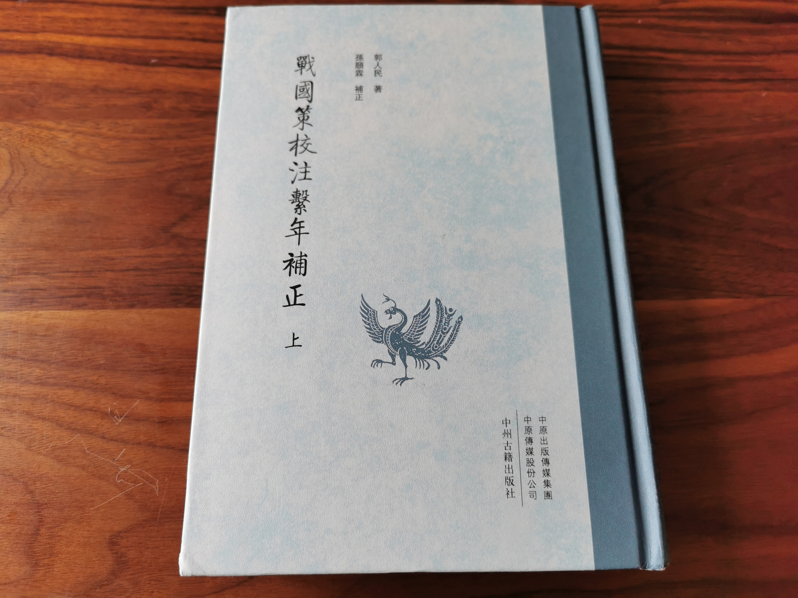
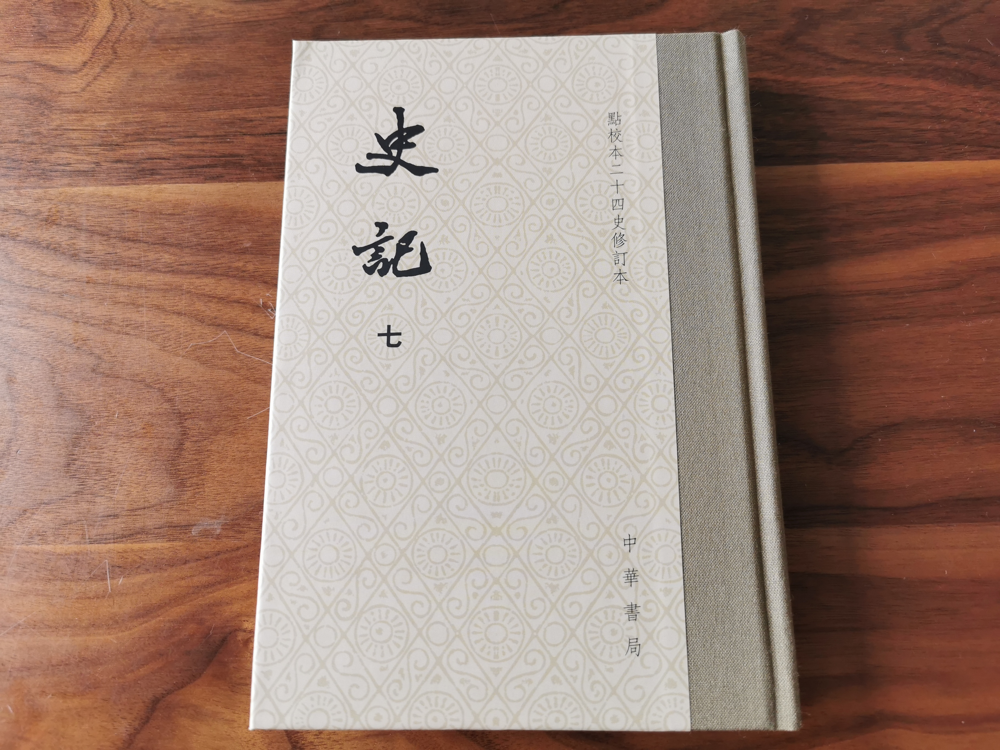

# 《古代汉语》读书笔记（二）

《古代汉语》第二单元选取了六篇《战国策》当中的文章。

为了学习本单元，我买来*郭人民*所著《战国策校注系年补正》一书作为主要参考。看前言可知这本书的作者用功很深，并且它印刷装帧排版都不错，算是市面上比较精良的繁体校注版本了。

此外我还参考了以下电子版书籍来解答我的疑问。

| 书名               | 译注者           | 出版社       | 种类 |
| ----------------- | --------------- | ----------- | --- |
|《战国策（套装共2册）》|上海古籍出版社     |上海古籍出版社 | 注   |
|《战国策译注》       |王延栋             |中华书局      |注+译 |
|《战国策（全2册）》   |缪文远、缪伟、罗永莲 |中华书局      |注+译 |

《战国策》记录的是战国时代的故事，但一般认为它不能被当作像《左传》那样严谨的史书。

这本书是由西汉时*刘向*所整理编辑的。它应当不是一个人的著述——我在学习这个单元时也体会到了不同的课文之间有着不小的语言风格差异。

一个很有意思的现象是，《战国策》与《史记》是有完全重复的段落的！我在学习这个单元之前竟然完全不知道这一点。

例如，《战国策》中入选过中学语文课本的《触龙说赵太后》，就几乎整篇都出现在了《史记·赵世家》里——仅有一些字词的差别，句子的顺序都是完全一样的，如果用现代的论文查重工具，估计会得出重复率为98%。

而且，这样的情况还比比皆是。例如，本单元所选的第五篇课文，《鲁仲连义不帝秦》，即与《史记·鲁仲连邹阳列传》中的前面小半部分完全重复。

所以我们就有一个自然而然的疑问：是《史记》抄袭了《战国策》，还是《战国策》抄袭了《史记》呢？

*刘向*生活的年代为公元前77年到公元前6年，而《史记》的作者*司马迁*据考证最晚出生于公元前135年，大约是*刘向*爷爷辈的人。那么是《战国策》在编辑的时候选取了《史记》中的篇章吗？

求助互联网后我了解到，现在学界一般认为是《战国策》和《史记》都参考了同一批战国时代流传下来的文献。1973年，在长沙马王堆三号汉墓出土了一批帛书，其中一部类似于今本《战国策》，整理后定名为《战国纵横家书》。百度百科说：

> 书中避刘邦讳，应是汉惠帝时的抄本。现存27章，325行，11000余字。其中11章的内容见于《战国策》和《史记》，文句也大体一致，是战国纵横家言的选本。另16章则属佚文，主要是苏秦游说活动的记录。其书反映了战国重大史实和历史特点，对修订和补充《战国策》有很高的价值。

汉惠帝时期要早于司马迁生活的年代，所以必然不会是《战国策》选取了《史记》中的篇章，而是《史记》参考了《战国策》的原始版本。

我几年之前买过一套平装版的中华书局所发行的点校本二十四史修订版《史记》。学习本单元时我经常要翻它，却感觉装订和印刷一般，于是又买了精装版的该书；平装版被我二手卖掉了。

## 【一】馮諼客孟嘗君（齊策）

> 【1】齊人有馮諼者，貧乏不能自存，使人屬孟嘗君，願寄食門下。孟嘗君曰：“客何好？”曰：“客無好也。”曰：“客何能？”曰：“客無能也。”孟嘗君笑而受之，曰：“諾。”

*孟尝君*是齐国有名的公子，他以门下有食客三千著称。我读了《史记·孟尝君列传》之后，方知他曾经依靠鸡鸣狗盗之徒的帮助，脱身于秦国的追杀。*冯谖*作为一个没有任何能力彰显于世的贫困户，竟然也能随随便便就成为*孟尝君*的门客，可见其招徕贤才真是来者不拒。所以这一段虽然看起来像是故意欲扬先抑，倒也符合人物的本来行事风格。

> 【2】**左右以君賤之也，食以草具**。居有頃，倚柱彈其劍，歌曰：“長鋏歸來乎，食無魚！”左右以告。孟嘗君曰：“食之，比門下之客。”居有頃，復彈其鋏，歌曰：“長鋏歸來乎，出無車！”左右皆笑之，以告。孟嘗君曰：“爲之駕，比門下之車客。”於是乘其車，揭其劍，過其友曰：“**孟嘗君客我！**”後有頃，復彈其劍鋏，歌曰：“長鋏歸來乎，無以爲家！”左右皆惡之，以爲貪而不知足。孟嘗君問：“馮公有親乎？”對曰：“有老母。”孟嘗君使人給其食用，無使乏。於是馮諼不復歌。

此段第一句“左右以君賤之也，食以草具。”读来与后面的文字联系不紧密，细想来应当归属于第一段的最后。即：

> 孟嘗君笑而受之，曰：“諾。”左右以君賤之也，食以草具。

如此一来，*孟尝君*的左右随从正是因为听到说*冯谖*没什么本事，而*孟尝君*又笑了，所以认为*孟尝君*是在笑话*冯谖*，是轻视他。我翻阅《战国策校注系年补正》，其段落划分竟也是如此。

《战国策》各篇都是独立成篇的，但是每一篇并没有自带标题。这里的题目“馮諼客孟嘗君”乃是后人所添加。在《战国策校注系年补正》和其他版本的战国策里这篇都是叫做“齊人有馮諼者”，即取首句代之。“馮諼客孟嘗君”这个标题也见于《古文观止》。但是我们从这第二段中的“孟嘗君客我！”一句可见，取标题为“孟嘗君客馮諼”是不是更为合适，更符合《战国策》的语言习惯呢？

> 【3】後孟嘗君出**記**，問門下諸客：“誰習計會，能爲文收責於薛者乎？”馮諼署曰：“能。”孟嘗君怪之，曰：“此誰也？”左右曰：“乃歌夫‘長鋏歸來’者也。”孟嘗君笑曰：“客果有能也！吾負之，未嘗見也。”請而見之，謝曰：“文倦於事，憒於憂，而性懧愚，沉於國家之事，開罪於先生。先生不**羞**，乃有意欲爲收責於薛乎？”馮諼曰：“願之。”於是約車治裝，載券契而行。辭曰：“責畢收，以何市而反？”孟嘗君曰：“視吾家所寡有者。”

此段第一句中的“記”字《古代汉语》解释为：

> 記，大約是文告之類。

这个解释显得没有什么把握的样子。翻阅《战国策校注系年补正》，发现其将此处的“記”字完全当“計”字来解释了，作“簿計，賬本”之意。这显得很不合理，因为这句话后面不远处就有“誰習計會”一句。如果按“記”同“計”来说的话，作者是不太可能在一个段落里面表达同一个意思时用两个不同的字的。

查阅《学生实用：古汉语常用字字典》中“记”字的解释有：

> ①<动>记录，载录。☆特指类似文告的一种公文，公牍，札子。《战国策·齐策四》：“后孟尝君出**记**，问门下诸客：‘谁习计会，能为文收责于薛者乎？’”

可见与《古代汉语》的解释完全一致。翻阅其他注本，都译作”文告“。这种解释我也觉得很通顺。所以，《古代汉语》此处的解释应当把”大概“二字去掉为佳。

另外，此段“先生不羞”句中的“羞”字《古代汉语》解释为：

> 不羞，不以爲羞。

把这个意思代入到句子中，那么这句话就是：先生不因此（因为我得罪了你）而感到害臊，竟然愿意帮我去薛地收债吗？

这个解释颇为奇怪。《战国策校注系年补正》对此没有注释。查阅《学生实用：古汉语常用字字典》中“羞”字的解释有：

> ①<动>进献。《左传·隐公三年》：“可荐于鬼神，可～于王公。”

> ②<名>美味的食品。唐·韩愈《祭十二郎文》：“使建中远具时～之奠，告汝十二郎之灵。”

> ③<名>耻辱。《孟子·公孙丑上》：“无恻隐之心，非人也；无～恶之心，非人也。”

> ④<动>怕，害怕。唐·刘禹锡《赠眼医婆罗门僧》：“看朱渐成碧，～日不禁风。”

> ⑤<动>害臊，难为情。唐·李白《长干行》：“十四为君妇，～颜为君开。”

现代汉语的“羞”用得最多的应当是后起意，比如羞愧、害羞等。而此处的“羞”应当与羞耻的“羞”意思相同，这句话可以解释为：先生不因此（因为我得罪了你）而感到耻辱，竟然仍然愿意帮我去薛地收债吗？其言下之意：先生真是雅量呀！

由此可见，《古代汉语》的这里的解释其实不完整或者说不够现代，它应当是：**不羞，不以爲耻辱**。事实上《古代汉语》第十一单元的常用词部分也收录了“羞”字。它只有两个解释，其一为“进献美味”，其二为“羞惭、丢脸”。这是显然不如字典里的解释那么精确的，“羞惭”与“耻辱”这两个意思在现代汉语里是不会混为一谈的。

> 【4】驅而之薛，使吏召諸民當償者，悉來合券。券徧合，起，矯命以責賜諸民，因燒其券，民稱萬歲。

> 【5】長驅到齊，晨而求見。孟嘗君怪其疾也，衣冠而見之，曰：“責畢收乎？來何疾也？”曰：“收畢矣。”“以何市而反？”馮諼曰：“君云‘視吾家所寡有者’，臣竊計君宫中積珍寶，狗馬實外廄，美人充下陳，**君家所寡有者以義耳**。竊以爲君市義。”孟嘗君曰：“市義奈何？”曰：“今君有區區之薛，**不拊愛子其民**，因而賈利之。臣竊矯君命，以責賜諸民，因燒其券，民稱萬歲，乃臣所以爲君市義也。”孟嘗君不説，曰：“諾。先生休矣！”

此两段我读起来略有些虚。*冯谖*“矯命以責賜諸民”，*孟尝君*的钱说不要就不要了。此时*孟尝君*竟然仅仅是不悦而已！这颇难说通。我读了一下《史记·孟尝君列传》，其描述与《战国策》有很大的不同，而关于“矯命以責賜諸民”这一段则添加了大量的细节，包括最后*冯谖*是如何说服*孟尝君*的情况。《史记·孟尝君列传》应当更接近史实。

“君家所寡有者以義耳”这一句，《古代汉语》的解释是：

> 以，疑是衍文。

按《现代汉语词典（第七版）》的解释，**衍文**是指“因缮写、刻板、排版错误而多出来的字句”。也就是说《古代汉语》认为这句话本来是“君家所寡有者義耳”，意思是“您家里所缺乏的是‘义’罢了”。

但是如果这里的“以”字不是衍文，而是作介词用，那么这句话也可以解释为“您家里所缺乏的在于一个‘义’字罢了”，似乎也通顺。《战国策校注系年补正》对此没有注释。再翻阅其他注本，中华书局的《战国策译注》以及三全本《战国策（全2册）》都给这句话加了一个逗号：

> 君家所寡有者，以义耳！

而对于“以”字则并没有单独的解释。

总之，目前我偏向于“以”字不是衍文。这还需要更多的语料来支持这一猜测，我在此暂时没有深入了。

“不拊愛子其民”这一句读起来则颇为拗口。“拊”与“抚”意思极为相近，此处当作“安抚”之意而无异议。这句话的意思就是说不安抚薛地的民众。然而如果这句话是“不拊愛其民”或者“不子其民”都要通顺得多。《古代汉语》对此解释为：

> 子其民，以其民爲子，就是把薛地的人民堪称自己的子女。子，用如動词。

单看“子其民”这三个字，当然是可以这么解释的。但是拊、愛这两个字却都不可能做状语，而只能做谓语，那么难道你这一个句子里有两个谓语不成？如果真的是两个谓语，其中“子”字只能是以动用法，但是拊愛却不能是以动用法。所以《古代汉语》的这个解释是没有把问题解释真正清楚的。《战国策译注》翻译这句话为：

> 却不把那里的百姓当作自己的子女一样来抚爱。

从意思上说当然大概是这么个意思，但是从语法上说我们依然没有得到一个满意的分析。搜索了网络上关于此句的解释，发现有人认为此处就是三个动词连用；也有人认为这里有衍文。目前我偏向于有衍文或者是有其他传抄错误。

> 【6】後朞年，齊王謂孟嘗君曰：“寡人不敢以先王之臣爲臣。”孟嘗君就國於薛。未至百里，民扶老攜幼，迎君道中。孟嘗君顧謂馮諼：“先生所爲文市義者，乃今日見之！”

> 【7】馮諼曰：“狡兔有三窟，僅得免其死耳；今君有一窟，未得高枕而臥也。請爲君復鑿二窟！”孟嘗君予車五十乘，金五百斤，西遊於梁，謂惠王曰：“齊放其大臣孟嘗君於諸侯，諸侯先迎之者，富而兵强。”於是梁王虚上位，以故相爲上將軍，**遣使者黄金千斤**，車百乘，往聘孟嘗君。馮諼先驅，誡孟嘗君曰：“千金，重幣也；百乘，顯使也。齊其聞之矣。”梁使三反，孟嘗君固辭不往也。

“遣使者黄金千斤”读起来有点不通，似乎中间有个字丢掉了。紧接着后面一段就有“遣太傅**賫**黄金千斤”。一开始我认为可以加个逗号以表示并列，即“遣使者，黄金千斤，車百乘，往聘孟嘗君。”这样一来使者、黄金、车就都是并列的关系，基本能说通。其他注本的《战国策》也**全都**印证了我的这个想法。但目前我还是倾向于有脱字。

> 【8】齊王聞之，君臣恐懼。遣太傅賫黄金千斤，文車二駟，**服劍一**。封書謝孟嘗君曰：“寡人不祥，被於宗廟之祟，沉於諂諛之臣，開罪於君。寡人不足爲也；願君顧先王之宗廟，姑反國統萬人乎！”馮諼誡孟嘗君曰：“願請先王之祭器，**立宗廟於薛**！”廟成，還報孟嘗君曰：“三窟已就，君姑高枕爲樂矣。”

对于“服劍一”的解释，《古代汉语》为：

> 服劍，佩帶的劍。

我以为是**能**佩戴在腰上的剑。直到翻了《战国策校注系年补正》，才发现它的意思其实是：

> 服劍，王所自佩之劍。服，佩。

这就合情合理多了。剑象征着权柄，*齐王*赐予*孟尝君*自己佩戴的剑，表示其愿意分享自己的权利给*孟尝君*，是诚意的表现。所以我觉得《古代汉语》在这里可以解释得更详细一点。

当*孟尝君*收到*齐王*的道歉信之后，*冯谖*只说要“立宗廟於薛”这一件事情。结合前文我们知道，狡兔三窟，一窟为薛地，另一窟为*魏王*所发的聘书，最后一窟就是“立宗廟於薛”。那么“立宗廟於薛”的政治目的是什么呢？怎么就成了这三窟中的最后一窟呢？

在学习第一单元第一课的时候，我有查阅《学生实用：古汉语常用字字典》上“都”字的解释：

> ① <名>大城市。☆特指建有宗庙的城市。《左传·庄公二十八年》：“凡邑，有宗庙先君之主曰～，无曰邑。”

所以可以肯定的是，薛地在立宗庙之前只是邑，庙成之后就升级为都了。根据《史记·孟尝君列传》，*孟尝君*最后也确实相自立于薛了：

> 齊襄王立，而孟嘗君中立於諸侯，無所屬。齊襄王新立，畏孟嘗君，與連和，復親薛公。

我的理解是，立宗庙乃是成为诸侯的必要步骤。没有宗庙，*孟尝君*祭祀的时候就只能跑到齐国的都城去祭拜先祖了；而有了宗庙，*孟尝君*就成为了事实上的*薛公*。这就是立宗庙的重大政治意义。

> 【9】孟嘗君爲相數十年，無纖介之禍者，馮諼之計也。

根据《史记·孟尝君列传》，*孟尝君*最后的结局为：

> 文卒，謚爲孟嘗君。諸子爭立，而齊魏共滅薛，孟嘗絶嗣無後也。

## 【二】趙威后問齊使（齊策）

这篇文章的事迹不见于《史记》。

> 【1】齊王使使者問趙威后，書未發，威后問使者曰：“歲亦無恙耶？民亦無恙耶？王亦無恙耶？”使者不説，曰：“臣奉使使威后，今不問王而先問歲與民，豈先賤而後尊貴者乎？”威后曰：“不然。苟無歲，何以有民？苟無民，何以有君？**故有問，舍本而問末者耶**？”

这最后一句读不通，我疑心为“問”为衍文，即应当为：故有舍本而問末者耶？句末“耶”字直接表示反问。查证《战国策校注系年补正》，发现其正文竟然与我所想的一致，没有“問”字。再翻阅上海古籍出版社的《战国策》，此句同《古代汉语》。关于这句又有注释：

> 姚本一无“问”字。

姚本即*姚宏*所校订的《战国策》版本。《战国策》现今所通行的版本来源主要有两种，一为南宋剡川*姚宏*校本，一位缙云*鲍彪*注本。这两种又都是由*曾巩*所集校之本蜕变而来。清代嘉庆年间的黄丕烈“褒扬姚本之可贵，能保存古籍原貌；抨击鲍彪之无端，窜乱旧集”。

仅就此处而言，明显姚本所传更善。中华书局三全本《战国策（全2册）》无此“问”字。而《战国策译注》则有此“问”字。

> 【2】乃進而問之曰：“齊有處士曰鍾離子，無恙耶？是其爲人也，有糧者亦食，無糧者亦食；有衣者亦衣，無衣者亦衣。是助王養其民也，何以至今不業也？葉陽子無恙乎？是其爲人，哀鰥寡，卹孤獨，振困窮，補不足。是助王息其民者也，何以至今不業也？北宫之女嬰兒子無恙耶？徹其環瑱，至老不嫁，以養父母，**是皆率民而出於孝情者也**，胡爲至今不朝也？此二士弗業，一女不朝，何以王齊國、子萬民乎？於陵子仲尚存乎？是其爲人也，上不臣於王，下不治其家，中不索交諸侯。此率民而出於無用者，何爲至今不殺乎？”

“是皆率民而出於孝情者也”这句较为难以理解。《古代汉语》的注释为：

> 率，領導。孝情，孝心。

“率”字似乎更应当解释为做出表率。“率民”即为民众做出表率。但是这里对“皆”字和“出於”均没有做出解释。

**首先**，关于“皆”字我查阅字典而无所得。中华书局三全本《战国策（全2册）》对于“皆”字没有显式地译出。而《战国策译注》则作其本义而译出：

> 她摘掉耳环和耳饰，到老也不嫁人，来养活父母。这都是引导百姓注重孝道的人。

我觉得这里的“皆”字应为衍文。这里讲*婴儿子*的孝心虽然写了三句话，但是其实归根结底是一件事情——为了赡养父母呆在家里不出嫁。只讲这一件事情而用“皆”字是不合逻辑的。

此段后面有一句“此率民而出於無用者”，这句话里并无“皆”字。但在这里讲*子仲*没用的时候却真切地说了上、中、下三件事，此处如果作“此**皆**率民而出於無用者”，应当完全是合理的。所以，没有理由同一段话里可以用“皆”字的地方没有用，不应当用的地方反而用了。此处是衍文的概率不小。

**其次**，关于“出於”二字我查阅字典仍然无所得。但是“出”字的本义是由内而外，如果尝试从其本义来理解这句话，就是说*婴儿子*为民做出了表率，她（由内而外）表现出来的是孝心。我姑且就这么理解，感觉颇为通顺。

## 【三】江乙對荆宣王（楚策）

这篇文章或许就是寓言狐假虎威的出处。

> 【1】荆宣王問羣臣曰：“吾聞北方之畏昭奚恤也，果誠何如？”羣臣莫對。江乙對曰：“虎求百獸而食之，得狐。狐曰：‘子無敢食我也！天帝使我長百獸，今子食我，是逆天帝命也。子以我爲不信，吾爲子先行，子隨我後，觀百獸之見我而敢不走乎？’虎以爲然，故遂與之行，獸見之皆走。虎不知獸畏己而走也，以爲畏狐也。今王之地方五千里，帶甲百萬，而專屬之昭奚恤。故北方之畏奚恤也，其實畏王之甲兵也——猶百獸之畏虎也。”

*荆宣王*即是*楚宣王*，其在位年代为公元前369年到公元前339年，处于战国中期。此段中主要有两个人物，一个是*江乙*，另一个是*昭奚恤*。我翻阅《史记·楚世家》，没有发现这两个人的事迹；甚至*楚宣王*也可谓是路人角色，总共只有一句话提到。

《古代汉语》介绍说：

> 江乙，一本作“江一”，魏人，有智謀，當時在楚國做官。

然而，从这一段的内容来看，*江乙*表面上是恭维*楚宣王*，其实是在暗讽*昭奚恤*。*江乙*把*楚宣王*比作虎，那么*昭奚恤*就是狐了。这个故事中狐其实是在欺骗虎，那么*昭奚恤*就是在欺骗*楚宣王*。

翻看《战国策·楚策》第一卷的目录，发现和*江乙*相关的篇章有：

- 江尹欲惡昭奚恤章
- 江乙惡昭奚恤章
- 江乙惡昭奚恤於楚章
- 江乙説安陵君章
- 江乙爲魏使於楚章

包括本篇（荆宣王問羣臣章），光讲*江乙*诋毁*昭奚恤*的就至少有四篇之多！可见其真的是对*昭奚恤*恨之入骨呀。

## 【四】莊辛説楚襄王（楚策）

此篇选文的事迹亦不见于《史记·楚世家》。*楚襄王*即*頃襄王*，其时已是战国末期，其父*楚懷王*被虏至秦国，且本属于楚国的大片土地被秦国所占领。

我仔细读完这一篇文章，发现其关于地理位置和史实年代的记载极为混乱。所以，这篇文章只能当散文来读，从了解史实的角度应该没啥价值。

> 【1】莊辛謂楚襄王曰：“君王左州侯，右夏侯，輦從**鄢陵**君與**壽陵**君，專淫逸侈靡，不顧國政，郢都必危矣！”襄王曰：“先生老悖乎？將以爲楚國祅祥乎？”莊辛曰：“臣誠見其必然者也，非敢以爲國祅祥也。君王卒幸四子者不衰，楚國必亡矣！臣請辟於趙，淹留以觀之。”

我翻阅诸多注本，没有哪个注本的注释给出了寿陵这个地名的位置；《中国历史地图集》上也没有标注。我印象中故楚地带“寿”字的地名有两处，一为今湖南常德汉寿县；二为今安徽淮南寿县，古称寿春，也即楚国被秦所灭之前的国都。汉寿是汉代才开始有的地名，于是我猜测为安徽寿县。因为前面说了，这篇文章里的地名和年代记录得其实很乱，所以我也未做深究了。

> 【2】莊辛去之趙，留五月，秦果舉鄢、郢、巫、上蔡、陳之地。襄王流揜於城陽。於是使人發騶徵莊辛於趙。莊辛曰：“諾。”

> 【3】莊辛至。襄王曰：“寡人不能用先生之言，今事至於此，爲之奈何？”莊辛對曰：“臣聞鄙語曰：‘**見兔而顧犬**，未爲晚也；亡羊而補牢，未爲遲也。’臣聞昔湯武以百里昌，桀紂以天下亡。今楚國雖小，絶長續短，猶以數千里，豈特百里哉？”

“亡羊而補牢，未爲遲也”乃是流传千古的成语，但是它前头这句“見兔而顧犬，未爲晚也”又是什么意思呢？《古代汉语》的注释为：

> 顧，回頭看。

这等于说了句废话。我求助于别的注本，中华书局三全本《战国策（全2册）》译作：

> 见到兔子再放出猎犬还不算晚；

《战国策译注》则译作：

> 看见兔子再回头招呼狗，并不算晚；

这个翻译还是能站住脚的。

> 【4】“王獨不見夫蜻蛉乎？六足四翼，飛翔乎天地之間，俛啄蚊虻而食之，仰承甘露而飲之。自以爲無患，與人無爭也；不知夫五尺童子，方將調飴膠絲，加己乎四仞之上，而下爲螻蟻食也。”

> 【5】“夫蜻蛉其小者也，黄雀因是以。俯噣白粒，仰棲茂樹，鼓翅奮翼。自以爲無患，與人無爭也；不知夫公子王孫，左挾彈，右攝丸，將加己乎十仞之上，以其類爲招。晝游乎茂樹，夕調乎酸醎。倏忽之間，墜於公子之手。”

此处最后两句是明显的传抄错误。不知道为什么传世的版本都还保留错误的顺序。

> 【6】“夫黄雀其小者也，黄鵠因是以。游於江海，淹乎大沼，俯噣鱔鯉，仰囓䔖衡。奮其六翮，而凌清風，飄摇乎高翔，自以爲無患，與人無爭也；不知夫射者，方將脩其碆盧，治其矰繳，將加己乎百仞之上，被㔋磻，引微繳，折清風而抎矣。故晝游乎江河，夕調乎鼎鼐。”

> 【7】“夫黄鵠其小者也，**蔡靈侯**之事因是以。南游乎**高陂**，北陵乎**巫山**，飲**茹溪**之流，食**湘**波之魚，左抱幼妾，右擁嬖女，與之馳騁乎**高蔡**之中，而不以國家爲事；不知夫子發方受命乎靈王，繫己以朱絲而見之也。”

此段《古代汉语》注为：

> 一本作“蔡聖侯”。蔡國在今河南上蔡縣。

而《战国策校注系年补正》则认为：

> 此蔡國非蔡仲之後遷於州來之蔡國，是另一蔡國，即下文所云之高蔡。聖侯，高蔡之國君。

可以肯定的是，此处应作“蔡聖侯”。这个蔡必然不是河南的那个上蔡国！而是湖南常德附近的这个高蔡邑。因为后文有“北陵乎巫山”、“食湘波之魚”，巫山和湘水都是毫无争议的地点，最北才到巫山，活动于湘江流域，与河南的那个上蔡中间还隔着楚国的核心地带——荆州。高蔡在《中国历史地图集》中亦有明确标注；在下面的截图中我将本文所涉及的地点均用红线标出。

然后我们再看另外两个有争议的地点。

首先，《中国历史地图集》还标注有茹溪，乃是澧水的支流。然而《古代汉语》所注却是：

> 茹溪，水名，在巫山縣北。

此处《古代汉语》应该也是错的。今天的巫山县北只有大宁河、马渡河、巴岩子河，哪里有什么茹溪呢？况且高陂在**南**，巫山在**北**，文中虽未指出湘水的方向，但是其实际是在**东**，那么有什么理由应当在**西**的茹溪又跑到北边的巫山旁边去了呢？而如果按照澧水的支流来算，那么恰恰是在西边的。更何况此时常德附近的高蔡恰好就在这几个地方的正中间！

那么茹溪是今天的哪条河呢？根据《中国历史地图集》所标注，其今名为九渡溪，大约在今张家界市东南，著名的旅游景点天门山的南面。

> 澧水支流。源出张家界市永定区大坪镇西南望岩扒。流经山岔乡和慈利县金岩乡，在溪口镇汇入澧水。

至于《中国历史地图集》是如何考证出茹溪就是今天的九渡溪的，我就不得而知了。

最后，《古代汉语》关于高陂的注释是：

> 高陂（bēi），高丘。

有意思的是，20年前的老版本《古代汉语》对“陂”字的注音为pí。那么这个字到底是读bēi还是读pí呢？武汉有黄陂区，上海一号线地铁有黄陂南路站。我记得上海地铁报站是读pí的。翻阅《现代汉语词典（第七版）》可知武汉的叫黄pí，所以上海地铁没有读错。而当这个字作“山坡”的意思讲时，读bēi。所以《古代汉语》是在版本更新过程中将其读音按其解释的意思来注音了，这无可厚非。

然而，我认为此处的高陂应指一地名。因为此排比句中其他三个都是地名，那么高陂应大概率也是地名。常德市的南面乃是高耸的雪峰山山脉，高陂这个地方有可能藏在雪峰山里，也有可能指的就是雪峰山。这目前只是我的无证据瞎猜。

> 【8】“蔡靈侯之事其小者也，君王之事因是以。左州侯，右夏侯，輦從鄢陵君與壽陵君，飯封禄之粟，而載方府之金，與之馳騁乎雲夢之中，而不以天下國家爲事；不知夫穰侯方受命乎秦王，填黽塞之内，而投己乎黽塞之外。”

> 【9】襄王聞之，顔色變作，身體戰慄。**於是乃以執珪而授之爲陽陵君**，**與**淮北之地也。

此段有两处可疑。

首先，“於是乃以執珪而授之爲陽陵君”这句，我读起来感觉有点不通。尝试加一逗号，作“於是乃以執珪而授之，爲陽陵君”的话，稍通一点，但似乎还是缺了点什么。于是我翻阅《战国策校注系年补正》，发现其此处作“於是乃以執珪而授之，**封之**爲陽陵君”。竟然多出了两个字，其注释为：

> “封之”二字姚本无，今從曾本。

可知此处确实有可能有脱字。曾本应当是指*曾巩*的版本。可是为啥姚本和鲍本之外还有曾本？不是说传世的就只有姚本和鲍本吗？对此我实在懒得深究了。

其次，《古代汉语》关于“與”字的解释为：

> 與，通“舉”，攻下。楚王用莊辛之計，收復了淮北之地（見劉向《新序》）。

见到这个解释我又下意识地怀疑此处是否是过度解读了。本文前面有用过“舉”字的。

> 留五月，秦果**舉**鄢、郢、巫、上蔡、陳之地。

作者是不太可能表达同一个意思，前面用“舉”字，后面又用“與”字的。况且从字面意思看，此“與”字作给予讲是完全合理的。因为这一句讲的是楚王“授執珪”、“封陽陵君”，那么最后再来一个“與淮北之地”的话，简直就是一气呵成、无懈可击呀！

至于《新序》，其第二卷中第十五篇记录了同一件事情，描述得基本与《战国策》相同，但是语言文字颇多不同。这最后一段在《新序》中是：

> 襄王大惧，形体悼栗，曰：“谨受令。”乃封庄辛为成陵君而用计焉，与淮北之地。

关于“与”字的注释为：

> 与淮北之地：底本作“与举淮北之地十二诸侯”，文字有错乱。赵逵夫先生《庄辛〈谏楚襄王〉考校兼论〈新序〉的史料价值》认为，“举”及“十二诸侯”五字当为衍文。“与”乃“举”字之借，传抄中有人在“与”字旁注“举”字，以明本字，抄者不知其义，看作补缺之字，而抄入正文，遂成“与举淮北之地”。“十二诸侯”四字，乃是刘向《新序》所据原材料中别一篇开头文字误抄入此篇。其说是，今据改。《战国策·楚策四》即作“与淮北之地也”。与，通“举”，攻取。

我还是坚持认为内部证据大于外部证据，此处“與”字当非通“舉”讲更合理。当然，据说《新序》所载更贴近史实；但是正如我前面提到的，《战国策》中的此篇只能当散文来读，史实方面错乱实在太多，作为初学者我也不想深究了。

## 【五】魯仲連義不帝秦（趙策）

本文全篇亦见于《史记·鲁仲连邹阳列传》，所以遇到有不理解或者讲不通的地方我们可以对照《史记》来判断。

> 【1】秦圍趙之邯鄲。魏安釐王使將軍晉鄙救趙。畏秦，止於蕩陰，不進。

“止於蕩陰，不進”如果中间不加逗号应该会更流畅。事实上我翻阅其他诸多注本也是如此断句的。

> 【2】魏王使客將軍辛垣衍間入邯鄲，因平原君謂趙王曰：“秦所以急圍趙者，前與齊湣王爭强爲帝，已而復歸帝，以齊故；今齊湣王已益弱，方今唯秦雄天下，此非必貪邯鄲，其意欲求爲帝。趙誠發使尊秦昭王爲帝，秦必喜，罷兵去。”平原君猶豫未有所決。

> 【3】此時魯仲連適游趙，會秦圍趙，聞魏將欲令趙尊秦爲帝，乃見平原君曰：“事將奈何矣？”平原君曰：“勝也何敢言事？**百萬之衆折於外**，今又内圍邯鄲而不去。魏王使客將軍辛垣衍令趙帝秦，今其人在是。勝也何敢言事？”魯連曰：“始吾以君爲天下之賢公子也，吾乃今然後知君非天下之賢公子也。梁客辛垣衍安在？吾請爲君責而歸之！”平原君曰：“勝請爲紹介而見之於先生。”

“百萬之衆折於外”这一句，《史记·鲁仲连邹阳列传》作“前亡四十萬之衆於外”。我更倾向于原文是“百萬之衆”，因为*司马迁*作为写书的人，当然可以去精确地描绘这件事情中赵国的损失人数是四十万，但是当平原君谈及这件事的时候，更大的概率是提到一个概数。

> 【4】平原君遂見辛垣衍曰：“東國有魯連先生，其人在此，勝請爲紹介而見之於將軍。”辛垣衍曰：“吾聞魯連先生，齊國之高士也。衍，人臣也，使事有職，吾不願見魯連先生也。”平原君曰：“勝已泄之矣。”辛垣衍許諾。

> 【5】魯連見辛垣衍而無言。辛垣衍曰：“吾視居此圍城之中者，皆有求於平原君者也；今吾視先生之玉貌，非有求於平原君者，曷爲久居此圍城之中而不去也？”魯連曰：“世以鮑焦無從容而死者，皆非也。今衆人不知，則爲一身。彼秦者，棄禮義而上首功之國也，權使其士，虜使其民；彼則肆然而爲帝，**過而遂正於天下**，**則連有赴東海而死矣**，吾不忍爲之民也！所爲見將軍者，欲以助趙也。”辛垣衍曰：“先生助之奈何？”魯連曰：“吾將使梁及燕助之，齊楚則固助之矣。”辛垣衍曰：“**燕，則吾請以從矣**；若乃梁，則吾乃梁人也，先生惡能使梁助之耶？”魯連曰：“**梁未睹秦稱帝之害故也**；使梁睹秦稱帝之害，則必助趙矣。”辛垣衍曰：“秦稱帝之害將奈何？”魯仲連曰：“昔齊威王嘗爲仁義矣，率天下諸侯而朝周。周貧且微，諸侯莫朝，而齊獨朝之。居歲餘，周烈王崩，諸侯皆弔，齊後往。周怒，**赴**於齊曰：‘天崩地坼，天子下席，東藩之臣田嬰齊後至，則斮之！’威王勃然怒曰：‘叱嗟！而母，婢也！’卒爲天下笑。故生則朝周，死則叱之，誠不忍其求也。彼天子固然，其無足怪。”

此段疑点较多。

**第一点**，关于“過而遂正於天下”这句《古代汉语》的解释为：

> 這句话不好懂，疑有誤字。《史記》作“過而爲政於天下”。司馬貞《索隱》：“謂以過惡而爲政也。”以備參考。

我倒是觉得这句话挺好懂的。“過”字表示甚而，即比称帝更为进一步的情况；“遂正於天下”或者“爲政於天下”即统一天下、治理天下。这个递进的关系用“過”字连起来是说得通的。后面*鲁仲连*说自己不忍为之民，只能蹈海赴死了。如果此处不是说秦统一天下，那么他不还是可以当他的齐国人，何必不忍为之民呢？按说有“爲政於天下”这句作为对照，此处是很好懂的，所以我完全摸不着头脑为什么此处《古代汉语》说不好懂！我翻阅《战国策校注系年补正》，其此处的注释与我的理解基本相同。翻阅其他注本的译文，也都与我理解的一致。

**第二点**，“則連有赴東海而死矣”这一句，《史记·鲁仲连邹阳列传》作“則連有蹈東海而死耳”，明显要更通顺。因为同一段中的另一个“赴”字乃是用作“讣告”的“讣”字之意。此处“耳”也相比“矣”更合语境，因为“耳”字有表示“...罢了”的意思。

**第三点**，“燕，則吾請以從矣”这一句则略有些绕口，《古代汉语》的注释为：

> 燕國嗎，那麽請您允許我認爲它是會聽從你的。請，客氣語，有請求允許的意思。以，以爲，認爲。

而《战国策校注系年补正》却解释为：
 
> 言燕國已聽從吾約請，尊秦爲帝。以，與“已”同。

此处《古代汉语》的解释应该是对的，此处只是一个“我们先不谈燕国”的意思。《战国策校注系年补正》当误。*辛垣衍*的其他事迹未见于史料，其令燕尊秦为帝更是无稽之谈。更何况燕在赵的北面，魏在赵的南面，从魏国北上，必然是先到赵国，不可能先跨过赵国去先说服燕国人尊秦为帝的。不知道为何《战国策校注系年补正》在没有史料证据的情况下就做此解释。

**第四点**，“梁未睹秦稱帝之害故也”这一句似乎中间应该加一个逗号，即“梁未睹秦稱帝之害，故也”。可以解释为：魏国还没有看到秦国称帝的危害，所以才这样（没有助赵）。

然而我翻遍所有手里的书，包括《战国策》、《史记》、《古文观止》等，没有一本书对此处做了注释的，也没有一本书在这句中间加了逗号的。《战国策译注》的译文倒是和我对这句的理解基本一致的，即

> 那是因为魏国还没有看到秦国称帝的危害罢了。

直觉上我还是坚持自己的断句，但是需要更多的证据和理论支撑——留待以后再来此处添加吧。

**最后**，*鲁仲连*所讲的故事中还诞生了国骂。但这个故事必然不符合史实，因为*齐威王*即位的时候是*周显王*十三年（公元前356年），也就是说*周显王*的爸爸*周烈王*已经崩了十三年了。至于史实是什么，我暂时未做深究。

> 【6】辛垣衍曰：“先生獨未見夫僕乎？十人而從一人者，寧力不勝，智不若耶？畏之也。”魯仲連曰：“然梁之比於秦，若僕耶？”辛垣衍曰：“然。”魯仲連曰：“然則吾將使秦王烹醢梁王！”辛垣衍怏然不**悦**，曰：“嘻！亦太甚矣，先生之言也！先生又惡能使秦王烹醢梁王？”魯仲連曰：“固也！待吾言之：昔者鬼侯、鄂侯、文王，紂之三公也。鬼侯有子而好，故入之於紂。紂以爲惡，醢鬼侯。鄂侯爭之急，辨之疾，故脯鄂侯。文王聞之，喟然而歎，故拘之於牖里之庫百日，而欲令之死。曷爲與人俱稱帝王，卒就脯醢之地也？”

按照《古代汉语》本单元古汉语通论关于古今字的内容，上古没有“悦”字而只有“説”字。此处亦当为后人传抄时所改。

> 【7】“齊閔王將之魯，夷維子執策而從，謂魯人曰：‘子將何以待吾君？’魯人曰：‘吾將以十太牢待子之君。’夷維子曰：‘子安取禮而來待吾君？彼吾君者，天子也。天子巡狩，諸侯辟舍，納筦鍵，攝衽抱几，視膳於堂下；天子已食，退而聽朝也。’**魯人投其籥，不果納，不得入於魯。將之薛，假涂於鄒**。當是時，鄒君死，閔王欲入弔。夷維子謂鄒之孤曰：‘天子弔，主人必將倍殯柩，設北面於南方，然後天子南面弔也。’鄒之羣臣曰：‘必若此，吾將伏劍而死。’故不敢入於鄒。鄒魯之臣，生則不得事養，死則不得飯含，然且欲行天子之禮於鄒魯之臣，不果納。今秦萬乘之國，梁亦萬乘之國，俱據萬乘之國，交有稱王之名。睹其一戰而勝，欲從而帝之，是使三晉之大臣，不如鄒魯之僕妾也。”

“魯人投其籥，不果納，不得入於魯。將之薛，假涂於鄒。”这一句，我在反复默写的过程中感觉到断句似有不妥。如果“不果納”和“不得入於魯”是属于同一句的话，那么他俩重复啰嗦了。而且“不果納”的主语应该是鲁人，即鲁人不纳*齐闵王*；而“不得入於魯”的主语则应当是*齐闵王*。所以，这句话应当断作：魯人投其籥，不果納。不得入於魯，將之薛，假涂於鄒。前一句的主语为鲁人，没有省略主语。而后一句则省略了主语*齐闵王*。如此一来，后一句里还包含有因果逻辑：*齐闵王*“不得入於魯”，所以将要去到薛地，而要到达薛地，则必须从邹地借道。

顺便插一句，这个事情也是符合地理逻辑的，齐国国都在临淄，也包括今天济南一带，鲁则是今天济南南面的曲阜，邹则是今天曲阜南面的邹城，薛则是今天曲阜再往南的枣庄。

再翻阅其他注本，《战国策校注系年补正》、中华书局三全本《战国策（全2册）》都与《古代汉语》一致。而中华书局《战国策译注》则为：

> 魯人投其籥，不果納。不得入於魯。將之薛，假涂於鄒。

即与我所认为的相比，多加一个句号，这也未尝不可。

最后，只有上海古籍出版社的《战国策（套装共2册）》与我所认为的断句完全一致！

> 【8】“且秦無已而帝，則且變易諸侯之大臣。彼將奪其所謂不肖而予其所謂賢，奪其所憎而與其所愛；彼又將使其子女讒妾爲諸侯妃姬，處梁之宫，梁王安得晏然而已乎？而將軍又何以得故寵乎？”

> 【9】於是辛垣衍起，再拜謝曰：“始以先生爲庸人，吾乃今日而知先生爲天下之士也！吾請去，不敢復言帝秦！”

> 【10】秦將聞之，爲卻軍五十里。**適會魏公子無忌奪晉鄙軍以救趙擊秦**，秦軍引而去。

中华书局二十四史点校本修订版《史记》此处作：

> 適會魏公子無忌奪晉鄙軍以救趙，擊秦軍，秦軍遂引而去。

可见《战国策》中此句可断为：**適會魏公子無忌奪晉鄙軍以救趙，擊秦**。

此处加逗号和不加逗号是两种意思。不加逗号的话“擊秦”只是一个目的，与“救趙”并列而已，是否真实发生则未可知；而加了逗号的话“擊秦”就是“奪晉鄙軍”之后确实发生了的事情。那么史实又是如何呢？翻开《史记·魏公子列传》我便很快找到了答案：

> 至鄴，矯魏王令代晉鄙。晉鄙合符，疑之，舉手視公子曰：“今吾擁十萬之衆，屯於境上，國之重任，今單車來代之，何如哉？”欲無聽。朱亥袖四十斤鐵椎，椎殺晉鄙，公子遂將晉鄙軍。勒兵下令軍中曰：“父子俱在軍中，父歸；兄弟俱在軍中，兄歸；獨子無兄弟，歸養。”得選兵八萬人，進兵擊秦軍。秦軍解去，遂救邯鄲，存趙。

所以“擊秦”是史实，是确实发生了的事情，故此处当有逗号！比起没有逗号也更为通顺。一般来讲“以”字后面只跟着一个词才对；做一件事情一般也只有一个目的而已。

我手中其余注本皆无此逗号。

> 【11】於是平原君欲封魯仲連，魯仲連辭讓者三，終不肯受。平原君乃置酒，酒酣，起，前，**以千金爲魯連壽**。魯連笑曰：“所貴於天下之士者，爲人排患、釋難、解紛亂而無所取也；**即有所取者，是商賈之人也。仲連不忍爲也**。”遂辭平原君而去，終身不復見。

“以千金爲魯連壽”这一句，《古代汉语》注释为：

> 爲魯連壽，等於説祝魯連長壽。這是雙賓語結構。

《战国策校注系年补正》则注释为：

> 壽：猶讎，報酬。

此处《战国策校注系年补正》应该是牵强附会，因为它没有给出任何证据。商务印书馆的《古代汉语词典》用此处作为“祝福、祝寿”之意的例句，可以当作是权威定论了。我手里的其余译注本也皆未按报酬之意讲。

"即有所取者"这一句，《史记·鲁仲连邹阳列传》作：

> 即有取者，是商賈之事也。而連不忍爲也。

明显《史记》所传更贴近原始文献。比如*鲁仲连*前面已经自称“連”：

> 則連有赴東海而死矣。

可见其名为“連”，“仲連”应当为别人对他的称呼。此处不太可能又自称“仲連”，所以“仲”应该是讹字。

总的来讲，《战国策》与《史记》在这几段文字上有许多细节差异。我感觉《史记》的用词会更为精准，读起来也会更为通顺。因为并非疑点，所以我也就不把《史记》更为妥帖的地方在此一一列举了。

## 【六】觸龍説趙太后（趙策）

这篇课文是曾经入选过高中语文教材的名篇。它全文也见于《史记·赵世家》。

> 【1】趙太后新用事，秦急攻之。趙氏求救於齊。齊曰：“必以長安君爲質，兵乃出。”太后不肯，大臣强諫。太后明謂左右：“有復言令長安君爲質者，老婦必唾其面。”

> 【2】**左師觸讋願見太后，太后盛氣而揖之。**入而徐趨，至而自謝曰：“老臣病足，**曾**不能疾走，不得見久矣，竊自恕，而恐太后玉體之有所郄也，故願望見太后。”太后曰：“老婦恃輦而行。”曰：“日食飲得無衰乎？”曰：“恃粥耳。”曰：“老臣**今者**殊不欲食，乃自强步，日三四里，少益耆食，和於身。”太后曰：“老婦不能。”太后之色少解。

第二段首句应该为：

> 左師觸**龍言**：“願見太后。”太后盛氣而**胥**之。

“讋”字乃讹字，是后人传抄时将“龍”、“言”二字合并了。这已经是公论了，因为马王堆汉墓挖出来的帛书上面有这篇文章，就是写的“左師觸龍言”。我不能理解的是为何《古代汉语》更新这么多版本了却明知此为讹字而不直接使用正确的原文。我记得高中课文里面使直接作“触龙”的。

此外，我还认为“願見太后”乃引用之言，应该加上双引号。同样的道理，第一篇课文的第一句也应该是：

> 齊人有馮諼者，貧乏不能自存，使人屬孟嘗君：“願寄食門下。”

因为我发现“願”字作动词时就只是出现在人物的对话之中，表达说话的人希望做什么，与“請”字的意思类似。当然，这一点我还需要提供更多的数据作为证明。

这一段中另一个较为难理解的字是“曾不能疾走”中的“曾”字。《古代汉语》对这一句的注释为：

> 曾，放在“不”字的前面，加强否定的語氣。疾走，快跑。

查阅《学生实用：古汉语常用字字典》，发现此处应读zēng：

> ①<副>表示动作行为或事情的发生、事物的出现出乎意料，常和否定副词“不”“无”“微”连用，加强疑问语气。相当于“竟”“却”。

> ②<动>增加。这个意义后来写作“增”。

> ③<名>中间隔两代的亲属，如曾祖，曾孙等。

> ④<动>高举。

> ⑤<副>一直，从来。晋·陶渊明《五柳先生传》：“既醉而退，～不吝情去留。”

按照《古代汉语》对这一句的注释，此处应符合字典里的第一个释义。但是如果按第一个释义，却又不能完全符合其“出乎意料”的内涵。反而是第五个释义更能说通。只不过第五个释义也没有更多的例证，我也不敢认为此处应该按第五个释义来解释。求助商务印书馆的《古代汉语词典》，没有什么发现。再求助于《说文解字》，其解释为：

> 词之舒也。【注释】...“则也”，竟，乃的意思。

那么，我觉得就按《古代汉语》的注释理解就好了，可以不用显式地译出“曾”字。

这一段还有一句“老臣今者殊不欲食”颇令人费解。因为这一句后面讲述了*触龙*从不怎么想吃饭，到勉强自己去散步之后又稍微有点想吃饭的过程。“今”字只有表示现在的意思，不能表示别的时间。如果一开始就讲现在的事情，那就不合情理了。比如这里如果从“今者”改为“昔者”，就看起来合适了。《古代汉语》对此解释为：

> 這裹當“近來”講。殊，很。

这个解释有强词夺理之嫌。然而再看《史记·赵世家》里的这一段：

> 老臣**閒**者殊不欲食，乃彊步，日三四里，少益嗜食，和於身也。

这里就没有“今”字了，而是“閒”（间）字。查阅《学生实用：古汉语常用字字典》“间”字的解释可知：

> ③<副>近来。《汉书·叙传上》：“帝～颜色瘦黑。”

这么一来就对了，此处《战国策》其实为传抄错误！这也告诉我们一个道理，如果一个字放在句子里怎么都解释不通，那就说明这个字错了。语言乃是一个逻辑自洽的系统，作者写作时用某个字表达其常见意义的概率要大于表达其生僻意义的概率；而使用某个字表达一个意思，这个意思却完全不见于其他文献，那么就只能说明是作者写了错别字！对于古文而言，因为其历经上千年甚至两千多年，出现传抄错误实在是再常见不过的事情了！

> 【3】左師公曰：“老臣賤息舒祺，最少，不肖；而臣衰，竊愛憐之，願令得補黑衣之數，以衞王宫。没死以聞。”太后曰：“敬諾！年幾何矣？”對曰：“十五歲矣。雖少，願及未填溝壑而託之。”太后曰：“丈夫亦愛憐其少子乎？”對曰：“甚於婦人。”太后笑曰：“婦人異甚！”對曰：“老臣竊以爲媪之愛燕后，賢於長安君。”曰：“君過矣！不若長安君之甚！”左師公曰：“父母之愛子，則爲之計深遠。媪之送燕后也，持其踵爲之泣，念悲其遠也，亦哀之矣。已行，非弗思也，祭祀必祝之，祝曰：‘必勿使反！’豈非計久長，有子孫相繼爲王也哉？”太后曰：“然。”

> 【4】左師公曰：“今三世以前，至於趙之爲趙，趙主之子孫侯者，其繼有在者乎？”曰：“無有。”曰：“微獨趙，諸侯有在者乎？”曰：“老婦不聞也。”“此其近者禍及身，遠者及其子孫。豈人主之子孫則必不善哉？位尊而無功，奉厚而無勞，而挾重器多也。今媪尊長安君之位，而封之以膏腴之地，多予之重器，而不及今令有功於國；一旦山陵崩，長安君何以自託於趙？老臣以媪爲長安君計短也。故以爲其愛不若燕后。”太后曰：“諾，恣君之所使之。”於是爲長安君約車百乘，質於齊，齊兵乃出。

> 【5】子義聞之，曰：“人主之子也，骨肉之親也，猶不能恃無功之尊，無勞之奉，而守金玉之重也；而況人臣乎！”

《史记·赵世家》里相对应的段落比起《战国策》所传而言要更为合理，也更可能接近这几段文字最初的样子。我们还可以参考马王堆汉墓《战国纵横家书》来对照理解这段文字。马王堆汉墓下葬的年代大约要早于西汉文帝时期，所以《战国纵横家书》中的《触龙说赵太后》比《史记》和《战国策》成书都要早，没有这些传世版本长达2200年的信息传播损失。

## 读后感

《战国策》的成书可能要晚于《左传》大约300年。比较第一单元和第二单元的课文，我们可以看到汉语的许多变迁。

相比于《左传》，《战国策》读起来也明显要啰嗦浅白一些。我感觉如果是按照《左传》的风格，几乎可以把第二单元的课文压缩到只剩2/3的篇幅。

此外我还粗略总结了表达同一个意思时这两本书用字的差别。

| 所要表达的意思             | 《左传》用字 | 《战国策》用字 |
| ------------------------ | ---------- | ----------- |
| 军队                     | 师          | 军          |
| 怎么、哪里，表示疑问        | 焉          | 安          |
| 在，介词，表示在某处做了什么 | 于          | 乎、於       |

在本单元所选《战国策》的文章中，上述这几个《左传》中非常常见的字竟然完全找不到影子了。反之，《战国策》中却也出现了许多《左传》中似乎没有用过的字。

| 只在《战国策》中出现的字 | 意义 |
| -- | ------------------------ |
| 耶 | 疑问语气助词，《史记》中常作邪 |
| 则 | 连词，同今义                |
| 恶 | 读wū，疑问副词，类似于“安”   |
| 彼 | 第三人称代词                |
| 窃 | “窃以为”的“窃”             |
| 耳 | 罢了，语气助词              |

由此可见这300多年间古汉语的变化也非常大。

《战国策》的另外一个特点就是夸大成分很多，比如说秦军听到*鲁仲连*的话就后撤五十里这种事，我是完全不信的。没有魏公子无忌夺魏军击秦，鲁仲连就是说烂嘴也没用啊。《战国策》与史实多有不符乃是公论。我们现在注重的应该是它的文学价值。比如最后一篇课文《触龙说赵太后》，就是一个说客说服人的绝佳范本。

春秋有《左传》，所以我们可以一窥春秋时期数百年的全貌。但是战国时期却没有一部完整的由史家单独撰写的史书传世，到如今不能不说是一个巨大的遗憾。本来晋代挖出来了魏国的史书《竹书纪年》，可惜从晋代至今这本书又传丢了，还不如当初就让它留在地底下呢。

万幸我们还有《史记》，虽然其史实可靠度仍然不如《左传》，但至少能一窥全貌了。现在，我已经有了足够的渴望去读完《史记》了。而且学完了头两个单元，我也积累了一些信心。相信等到我真的去读《史记》的时候，能以比较高的效率读完它。