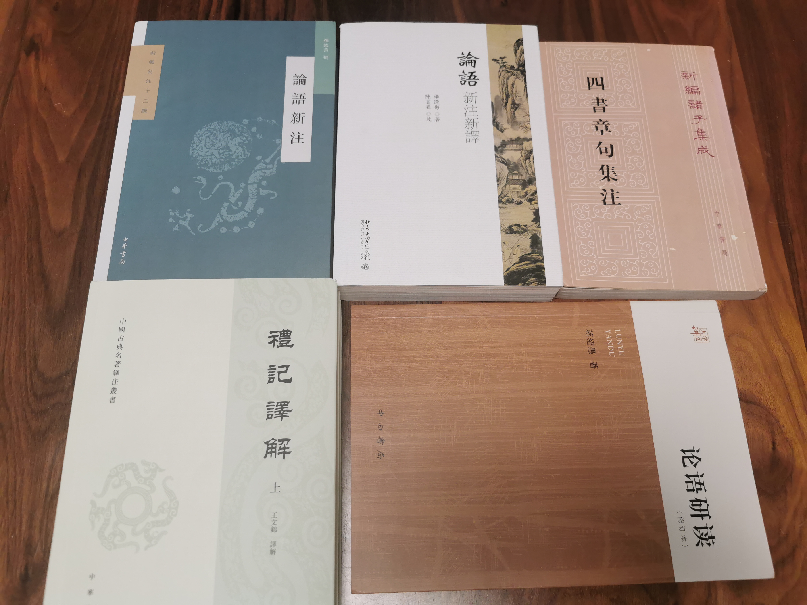

# 《古代汉语》读书笔记（三）

《古代汉语》第三单元选取了《论语》和《礼记》的部分篇章。

如果说要从中国古代以来的所有书中选出一本对中国人影响最深刻的书，那么这本书只能是《论语》。粗翻论语，里头全是成语。可以说《论语》里头的许许多多语言，已经融入到汉语的骨髓里去了。也就是说，今天中国人说的话，会经常不自觉地带有《论语》里头的语言。

而《礼记》则是一本杂书，部分内容与论语类似，也是记录了孔子及其弟子的言行，同样也是儒家经典之一。此外，《礼记》还包括《大学》、《中庸》这一类的纯论文形式的篇章。

众所周知，*朱熹*将《大学》、《中庸》、《论语》、《孟子》编成《四书章句集注》，后世成为科举官方教材，深刻影响了中国人数百年。

而*王力*先生则将《论语》和《礼记》选在了这本《古代汉语》的第三单元，《孟子》选在了第四单元。

学习本单元，我准备了以下书籍——以当代学者的著作为主。

| 书名           | 译注者           | 出版社        | 种类        |
| ------------- | ---------------- | ----------- | ----------- |
|《四书章句集注》  | 朱熹             |中华书局      | 注           |
|《论语新注》     | 孙钦善           |中华书局       | 注           |
|《论语新注新译》  | 杨逢彬           |北京大学出版社  | 注+译        |
|《论语研读》     | 蒋绍愚           |中西书局       | 讲义，非全注本或译本 |
|《礼记译解》     | 王文锦           |中华书局       | 注+译        |

此外，我还阅读了《史记·孔子世家》以扩充背景知识。事实上，我还应当读一读《春秋左传注》的第六册。因为这最后一册写的是鲁定公和鲁哀公时代的事情，恰好是*孔子*所处的时代。*左丘明*和*孔子*是一对好基友。*左丘明*在《左传》中经常引用*孔子*的言论，也描述了大量它们那个时代的历史。《左传》本身也是对*孔子*所著《春秋》的注解，是了解时代背景的最佳读物。可惜由于时间关系，我没读，只能以后再读了。

此处再说说这几本参考书。我之所以尽可能用当代学者的译注版本作为参考书，是因为当代学者往往视野较宽，能广征博引、融会贯通前人的校注成果。

首先，《论语新注新译》的著者*杨逢彬*家学渊源很深，其叔父即是《春秋左传注》的作者*杨伯峻*。

*杨伯峻*也撰有《论语译注》、《孟子译注》，这两本书都是当代影响比较广的注本。人教社的初高中语文教材的论语篇章就是直接引用*杨伯峻*的《论语译注》。

*杨逢彬*的祖父叫做*杨树达*，湖南人，是民国时期的著名学者，也曾经在湖南省立第一师范学校当过*毛泽东*的老师。我所知的就有他所撰的《汉书窥管》影响较大，此外也写过《论语疏证》一书。

三代治论语，想必*杨逢彬*这位学者能提出一些推翻前人却又能让人心服口服的观点来。

其次，《论语新注》的著者*孙钦善*是北京大学中国古典文献学博士生导师，是老一辈的权威学者。《论语新注》应该是脱胎自他2013年出版的《论语本解》。《论语新注》可以看作是《论语本解》的最新修订本。

最后，《论语研读》的作者*蒋绍愚*也是北京大学中文系教授、北京大学古代汉语教研室主任。《论语研读》属于读书札记类著作，它引用了从古至今几十本论语相关的注本，最新的两本恰好是*杨逢彬*的《论语新注》和*孙钦善*的《论语本解》。

读这《论语新注新译》和《论语研读》的前言，发现它们的作者都深受*王力*的影响，在书中都引用了*王力*的论文《训诂学上的一些问题》中的论点。

> 当我们读古书的时候，所应注意的不是古人应该说什么，而是实际上古人说了什么。如果先主观地肯定了应该说什么，就会想尽办法把语言了解为表达了那种思想，这有牵强附会的危险；如果先细心地看清了古人实际上说了什么，再来体会他的思想，这个程序就是比较科学的。所得的结论也是比较可靠的。

简而言之，*杨逢彬*和*蒋绍愚*这两位学者都赞同从语言本身入手，通过继承前人的成功经验（如清代王念孙、王引之父子的“审句例”），应用现代语言学的手段去考释疑难杂句。

而*孙钦善*的《论语新注》前言部分，则并没有类似观点的强调。

我非常赞同*杨逢彬*在《论语新注新译》的前言中阐述的一些观点。虽然我没有学过语言学，但是我学过信息论相关的知识。直觉告诉我，用统计学的思路去分析古文的语义，是最有前途方法。我甚至希望这些学者在争辩一个疑点时，能够计算出来各种解释的置信度。

## 論語·學而

> 【1】子曰：“學而時習之，不亦説乎？有朋自遠方來，不亦樂乎？人不知而不愠，不亦君子乎？”

> 【2】曾子曰：“吾日**三**省吾身：爲人謀而不**忠**乎？與朋友交而不信乎？傳不習乎？”

上古的“忠”不是特指，不仅是指忠君爱国的忠，而是泛指为人办事情尽心尽力，把别人托付的事情办好。曾子的这句话也体现了这个字的本义是如此。

此处“吾日三省吾身”的“三”字，作为状语，到底是确数还是泛指多次？*杨逢彬*的《论语新注新译》认为是泛指多次，并且举了一个反例说只有类似“君子道者三”这样的用法时，“三”字才是确数。而*孙钦善*的《论语新注》则认为是确数，并举了几十个论语中的例子说明论语里的“三”字不管哪种用法全都是用作确数——因为在所有的语境里恰好都是有三件相关的事物：

> 本章中的“三省”，一般解釋爲多次反省，根據是古人習慣用“三”“九”等數字泛指多數（參見汪中《述學·釋三九》）。其實本章中的“三”字，具體指下文提到的三件事，如【校注】部分所解。案，《論語》中“三”“六”“九”等數字，多爲實指，而非泛指，參見1·11及4·20“三年（指居喪期間）無改於父之道”，7·8“舉一隅不以三隅反”，7·25“子以四教”，8·4“君子所貴乎道者三”，9·4“子絶四”，14·28“君子之道三”，16·4“三友”，16·5“三樂”，16·6“三愆”，16·7“三戒”，16·8“三畏”，16·10“九思”，16·13“問一得三”，17·8“六言”、“六蔽”，17·6“能行五者於天下”，17·6“三疾”，17·21“三年之喪”，18·1“三仁”，19·9“三變”，20·2“尊五美，屏四惡”等。又，曾子所反省的三方面很重要，與孔子的思想一致，參見1·8“主忠信”，7·25“子以四教：文，行，忠，信”。

我认为此处应当是确数，*孙钦善*的《论语新注》论据充足；而*杨逢彬*的《论语新注新译》所谓的反例却并不能真的当作反例。如果要举反例，此处应当列举出《论语》当中用“三”字作状语，却又不是指三件事物的情况。虽然*杨逢彬*在他书的前言中说得头头是道，可是这里辩证的逻辑却是漏洞很大呀！

> 【3】子曰：“君子食無求飽，居無求安，敏於事而慎於言，就有道而正焉，可謂好學也已。”

## 論語·爲政

> 【1】子曰：“温故而知新，可以爲師矣。”

> 【2】子曰：“學而不思則**罔**，思而不學則**殆**。”

此处“罔”字在今天写作“惘然若失”的“惘”，是古今字的关系。意思是精神恍惚，怅然失意的样子。

然而这里的“殆”字并不好理解。《古代汉语》的注释为：

> 殆，疑惑。（从王引之说，见《经义述闻·通说上》。）

这个“殆”字最常见的意思是危险。如“知己知彼，百战不殆”，又如《论语·微子》里的“今之從政者殆而”。在此处，“殆”字作“危险”讲也是完全可以讲得通的：只思考不学习那就危险了，就会招致失败。

然而此处“殆”字作“疑惑”讲似为定论。翻阅《古代汉语词典》关于“殆”字的解释有：

> ② 疑惑。《论语·为政》：“多见阙～，慎行其余，则寡悔。”《史记·扁鹊仓公列传》：“良工取之，拙者疑～。”

此二例都是疑殆连用（多见阙殆前面还有一句多闻阙疑），这里殆、疑二字同义是毫无疑问了。翻阅《说文解字》，“殆”字的本义就是危险，至于疑惑的意思是怎么来的，暂不得而知了。

> 【3】子曰：“由，誨女知之乎？知之爲知之，不知爲不知，是知也。”

> 【4】子曰：“人而無信，不知其可也。大車無輗，小車無軏，其何以行之哉！”

## 論語·里仁

> 【1】子曰：“朝聞道，夕死可矣。”

> 【2】子曰：“參乎！吾道一以貫之。”曾子曰：“唯！”子出，門人問曰：“何謂也？”曾子曰：“夫子之道，忠恕而已矣。”

> 【3】子曰：“君子喻於義，小人喻於利。”

> 【4】子曰：“見賢思齊焉，見不賢而内自省也。”

## 論語·公冶長

> 【1】宰予晝寢。子曰：“朽木不可雕也，糞土之牆，不可杇也。於予與何誅！”子曰：“始吾於人也，聽其言而信其行；今吾於人也，聽其言而觀其行。於予與改是。”

> 【2】子貢問曰：“孔文子何以謂之文也？”子曰：“敏而好學，不恥下問，是以謂之文也。”

> 【3】季文子三思而後行。子聞之曰：“再，斯可矣。”

> 【4】顔淵季路侍。子曰：“盍各言爾志？”子路曰：“願車馬衣**輕**裘，與朋友共，敝之而無憾。”顔淵曰：“願無伐善，無施勞。”子路曰：“願聞子之志。”子曰：“**老者安之，朋友信之，少者懷之。**”

这里的“輕”字是衍文，已是公论。《古代汉语》的注释里也写到：

> 唐石经初刻本无“輕”字（见阮元《论语注疏校勘记》）。

我不理解的是为啥这些注本不在正文里直接去掉这个衍文？大不了去掉之后在注释里说明一下好了啊。难道还要把这个衍文世世代代再传他一千年吗？在这一点上只有*孙钦善*的《论语新注》做了一些改进，虽在正文中仍包含“輕”字，但用小括号括起，凸显它是衍文。我是建议《古代汉语》直接把这个字从正文里去掉，以遵从这本教材的初衷。

最后一句“老者安之，朋友信之，少者懷之”素来也是有争议的。关键点在于对“之”字所指代的对象的理解，一说认为指代*孔子*自己，另一说认为指代句中的“老者”、“朋友”、“少者”。然而，《古代汉语》的注释却是混合了这两种理解的：

> 对老年人，使他们安，对平辈的人（朋友），使他们能信任我，对少年人，使他们归依我。懷，归（依孔安国说）。

即，第一个“之”字指代“老者”，第二个“之”字指代*孔子*自己，第三个“之”字还是指代*孔子*自己。*杨逢彬*的《论语新注新译》也完全从此说。而*孙钦善*的《论语新注》则认为：

> “老者”三句：意謂對老者加以安撫，對朋友加以信任，對少者加以愛護。此從《論語義疏》及《論語集注》。

即认为三个“之”字都是指代句中的对象。

*蒋绍愚*的《论语研读》第56页对此也有详细讨论。他试图寻找先秦文献中“主语+动词+之”这种句式里，用“之”字指代说话人自己的情况。但他最终并没有找到这种例子。

我也认为三个“之”字都是指代句中的对象。因为只有这样，“之”字的语法意义在这个排比句中才是统一的。同一个字在排比句中具有相同的作用，这种可能性显然是更高的。*杨逢彬*的《论语新注新译》和《古代汉语》的注释是有先入为主的嫌疑的。正如*王力*先生自己说的：“当我们读古书的时候，所应注意的不是古人应该说什么，而是实际上古人说了什么。”

## 論語·雍也

> 【1】哀公問：“弟子孰爲好學？”孔子對曰：“有顔回者好學，不遷怒，不貳過。不幸短命死矣。今也則亡！未聞好學者也。”

> 【2】子曰：“賢哉回也！一簞食，一瓢飲，在陋巷，人不堪其憂，回也不改其樂。賢哉回也！”

> 【3】冉**求**曰：“非不説子之道，力不足也。”子曰：“力不足者，中道而廢，今女**畫**。”

*冉求*是姓名。但一般来说，在《论语》里著者都是称*孔子*的弟子为姓+字或者单独的字。例如称*颜渊*、*季路*、*冉有*、*公西华*，或者*子路*、*子游*、*子张*、*子夏*、*子贡*等。而*孔子*则称自己的弟子为单独的名，如*回*、*由*、*求*、*赤*、*赐*等。此处称*冉求*乃是《论语》中少数的例外。

但还有一种情况是称*孔子*的弟子为某子，例如*曾子*、*有子*、*冉子*等。而*曾子*出现的频率尤其高，所以有一种说法是《论语》的作者是*曾子*的弟子。

*孔子*批评*冉有*不肯迈出一步，用了一个“畫”字。《古代汉语》的解释是：

> 畫，畫界，畫斷。指给自己畫定一個界限，不肯前進。

翻阅《学生实用：古汉语常用字字典》中“画”字的解释为：

> ② <动>中断、停止。《论语·雍也》：“力不足者，中道而废，今女～。”

这种解释有明显纰漏。因为*孔子*都已经说了，*冉有*是“畫”，而非“中道而廢”。“中道而廢”和“中断”看起来很像是同一个意思，那么“畫”怎么可以解释为“中断”呢？这不就自相矛盾了吗？

再翻阅其他词典和《说文解字》后发现《古代汉语》的注释是符合“畫”字的本义的。即*冉有*直接与*孔子*的学说划清了界限，不愿涉足半步。

## 論語·述而

> 【1】子曰：“默而識之，學而不厭，誨人不倦，**何有於我哉**？”

“学而不厌，诲人不倦”乃是千古佳句。然而紧接着的这句“何有於我哉”又是什么意思呢？关于这一点，*杨逢彬*的《论语新注新译》有着精彩的讨论，体现出了他所倡导的考证方法的有效性。他说：

> “何有於……”是《論語》时代的习语，表示“……又算个什么”“……又算得了什么”。
> 例如：“雖及故耇，獲則取之，何有於二毛。”（《左傳·僖公二十二年》）“吉若獲戾，子將行之，何有於諸游？”（《昭公元年》）“將奪其國，何有於妻，唯秦所命從也。”（《国語·晋語四》）“君若不鑑而長之，君實有國而不愛，臣何有於死，死在斯敗矣！惟君圖之！”（《楚語下》）……

他在注释里引用了将近10个例子，这些例子的“何有於”看起来确实都是这么个意思。他还专门写了一篇论文来详细讨论这个问题，发表在《武汉大学学报》上。这个解释也让我想起来第一单元的《宫之奇諫假道》中的一句“將虢是滅，何愛於虞？”，也是有“虞又算得了什么”的意思。

在语义上，这么解释也是很说得通的：如果能够做到以上这三点，我*孔丘*又算得了什么呢？

相比而言，其他人关于这一句的解释都要逊色不少。《古代汉语》的注释是：

> 對我來説有什麽呀？也就是説：這三件串對我來説都不難。

这个解释应当是从了清代学者*刘宝楠*的《论语正义》。然而按照*杨逢彬*的说法，只有“於……何有”这种句式才是表示“對於……有何難”，是不同于“何有於……”。

而*孙钦善*的《论语新注》则注释为：

> 何有：還有甚麽，意思是此外無他。此種句型又見9·16。全句意謂對我來説此外還有甚麽呢。

可见这两本关于这句话又各有异见，且均不同于*杨逢彬*的《论语新注新译》。*孙钦善*的《论语新注》并没有做出什么有力的辩证，仅仅从经义的角度正面陈述了一下“*孔子*生平的志向”。这远不如*杨逢彬*的论证有说服力。

最后翻阅《論語集注》（即《四书章句集注》的论语部分），发现*朱熹*是这么说的：

> 言何者能有於我也。三者已非聖人之極至，而猶言不敢當，則謙而又謙之辭也。

这竟然又不同于以上三种解释！难怪*王力*在《训诂学上的一些问题》中说：

> 假定这种研究方法不改变，我们试着把十位学者隔离起来，分头研究同一篇比较难懂的古典文章，可能得到十种不同的结果。

其实*朱熹*的解释是很有道理的，因为同一篇的后文中就有“若聖與仁，則吾豈敢？抑爲之不厭，誨人不倦，則可謂云爾已矣。”——毫无疑问此句就是谦词。

仔细阅读*杨逢彬*的论文之后，我只能说，他从语言学的角度做出的论证，仍然是最说服力的。

> 【2】子曰：“德之不脩，學之不講，聞義不能**徙**，不善不能改，是吾憂也。”

此处“徙”字一般解释为“跟從”，这应该是没有什么争论的。然而“徙”字和“從”字从字形上看是极其相似的，那么会不会这两个字有什么关系呢？“徙”的本义是“迁移”，此处似乎用“從”字更为合理。更何况同一篇的后文中还有“擇其善者而從之，其不善者而改之”。

我翻阅了一下《说文解字》，发现此二字除了偏旁相同，意思相近，并没有什么本质上的联系。

我觉得有两种可能。其一，是在《论语》的流传过程中有人把“從”字抄成“徙”字了；其二，是在《论语》写成的时代因为这两个字意思相近所以原著者就是混用了。在第十二篇《颜渊》中还有：

> 子曰：“主忠信，**徙義**，崇德也。……”

目前我没有确定的结论，以后有时间再考证。

> 【3】子曰：“飯疏食，飲水，曲肱而枕之，樂亦在其中矣。不義而富且貴，於我如浮雲。”

> 【4】葉公問孔子於子路，子路不對。子曰：“女**奚**不曰：‘其爲人也，**發憤**忘食，樂以忘憂，不知老之將至云爾。’”

“奚”字似乎为《论语》、《孟子》中所特有的疑问代词。同样的句子，在《史记·孔子世家》中引用时“奚”字写都作“何”。这俩字看起来像是一个字的两种写法，或是一个字的两种方言读音？与“奚”字地位类似的还有“胡”、“曷”。“胡”、“曷”二字显然与“何”是同音字，然而“奚”字是如何与“何”同音的？

查看网络上的说法，百度百科的说法是：“……‘奚’后因同音的关系借用为疑问代词”。我没有搜到详细的解释，只搜到一堆*何猷君*和*奚梦瑶*的无聊新闻。

此外，“發憤”一词，按《现代汉语词典》的说法，是“决心努力”的意思。今有“发愤图强”，又写作“发奋图强”。至于它怎么就表示努力勤奋了，我并无了解。首先，可以肯定的是，“憤”字表示憋闷、烦闷的意思。这个字在古代主要只有这一个意思，与今天的“愤怒”之义有所区别。“發憤”这个词是不是说为了抒发自己的憋闷，而不得不勤奋努力？*司马迁*在他的《报任安书》里写到：

> 是僕終已不得舒憤懣以曉左右。

我想是恰好表达了这个意思吧。

在《论语》同一篇里，还有《古代汉语》未选入的一句也与“發憤”有关：

> 子曰：“不憤不啓，不悱不發。舉一隅不以三隅反，則不復也。”

“啓”字与“發”字应该是同义的，今天二字经常连用为“启发”。牛顿心里一直憋着力学的问题，因为苹果砸到他头上，得到启发，最终完成了《自然哲学的数学原理》。我想“發憤”的状态大概就是如司马迁和牛顿一般吧！

> 【5】子曰：“三人行，必有我師焉。擇其善者而從之，其不善者而改之。”

> 【6】子曰：“若聖與仁，則吾豈敢？抑爲之不厭，誨人不倦，則可謂云爾已矣。”公西華曰：“正唯弟子不能學也！”

此句读起来颇为拗口，因为虚词，

## 論語·泰伯

> 【1】曾子曰：“士不可以不弘毅，任重而道遠：仁以爲己任，不亦重乎？死而後已，不亦遠乎？”

## 論語·子罕

> 【1】子在川上曰：“逝者如斯夫，不舍晝夜！”

> 【2】子曰：“三軍可奪帥也，匹夫不可奪志也。”

> 【3】子曰：“歲寒，然後知松柏之後彫也。”

## 論語·鄉黨

> 【1】廄焚，子退朝，曰：“傷人乎？”不問馬。