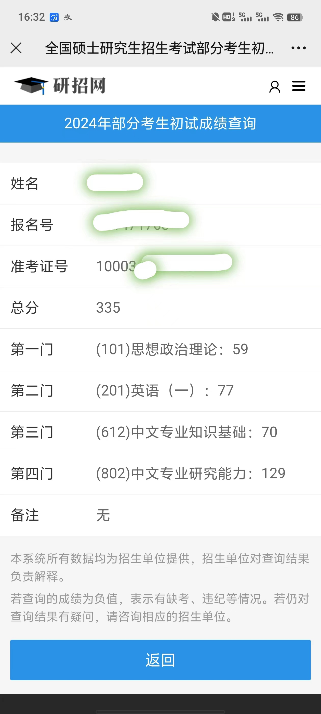

# 《古代汉语》学习中期报告

2022年元旦时，我心血来潮开始学习王力编纂的《古代汉语》。我的学习目标是能够**默写全部的课文**（文选部分）。

到2023年8月时，我把全部四册中的前两册课文基本默写了下来。然后，我就中断了后两册的继续学习。

2023年底，为了检验一下自己的学习效果，我又心血来潮参加了全国硕士研究生招生考试，报考了清华大学汉语言文学专业的**古典文献学**方向——因为这个专业方向的招生说明上指定了王力版《古代汉语》一、二、三册为参考教材。

王力版《古代汉语》的一、二册包括以下先秦著作的文选：

| 单元 | 课文选材来源 | 课文举例 |
| --- | --------------------------  | --------------------- |
| 一  | 《左传》                      | 《郑伯克段于鄢》        |
| 二  | 《战国策》                    | 《触龙说赵太后》         |
| 三  | 《论语》《礼记》               | 《学而》《苛政猛于虎》    |
| 四  | 《孟子》                      | 《寡人之于国也》         |
| 五  | 《墨子》《老子》《庄子》《荀子》等| 《北冥有鱼》《劝学》      |
| 六  | 《诗经》                      | 《氓》                 |
| 七  | 《楚辞》                      | 《离骚》               |

我把这一年半的学习过程分成几个阶段，总结和分享在这里。

## 准备阶段

2021年底我偶然翻到了《学生实用：古汉语常用字字典》的附录，其中有一篇叫做《古代汉语学习方法与技巧》，提到了最为推荐的学习教材是王力所著的《古代汉语》。王力是著名语言学家，他的名字可是如雷贯耳。于是我迅速网购了一套精装本。读罢序言，我便知道这正是我苦苦寻找的**古汉语学习一本通**了！

说干就干。这套书总共14个单元，我计划一个月默写一个单元的课文，总共花一年半的时间把四册课文全部默写熟练。

## 第一册一二单元阶段

最开始时，我只是大体读懂课文之后一遍又一遍地在纸上默写。

很快，我发现这样默写完了之后检查起来比较费力，于是我打开手机的记事本和手写输入法，在手机上默写。默写完了把文本发送到电脑上用文本比较器一比较，就能瞬间完成检查了。

于是，只要是有空余时间，我就会在手机上奋笔疾书。晚上回家没事的时候我就坐在桌子上默写，周末陪儿子去上培训班的时候我就坐在教室外默写，坐火车的的时候我也在默写。不得不说，智能手机真是个有用的学习工具：可以用记事本来默写，也可以安装*百度汉语*来查生字。

第一单元选择的来自《左传》的课文都不长，学习这些文章对于我来说是一个很好的起步。这一阶段，我也完全适应了繁体字的书写。

第二单元选择的来自《战国策》的课文有6篇，其文字深奥程度相对于来自《左传》的课文明显变小。但是我同时也发现一个问题，那就是第二单元的课文读不通的地方变多了，课本里的注释不能完全说服我的地方也变多了。

于是我开始总结自己的思考，准备把第一、二单元有疑惑的地方好好挖掘一下。

我买来对应的参考书，例如*杨伯峻*所著《春秋左传注》、*郭人民*所著《战国策校注系年补正》等等，同时收集了一些中华书局所出版的较为权威的三全本系列的《左传》、《战国策》电子版。

我把所有的疑惑和分析结果按单元总结在了一起作为读书笔记，上传到GitHub上以备以后逐步迭代。

到2022年5月，我已经能熟练默写一二单元的课文，并且整理完了这两个单元的读书笔记。

## 第一册三四单元阶段

第三、四单元课文内容是《论语》、《礼记》、《孟子》等儒家经典。

我依旧延续了前一阶段的学习方法。但在整理第三单元的读书笔记的时候，我发现《论语》里文字的深奥程度较《左传》有过之而无不及。我脑子里待解决的问题实在太多了。而且要解决这些问题，我目前的知识储备明显不够——这不是靠临时翻阅一些参考资料就能解决的。于是我暂时放弃了读书笔记的整理。

由于第三、四单元的课文总长度相对变长，我默写的效率也变慢了。面对第四单元的一些长篇课文，如《齐桓晋文之事》、《许行》等，我往往需要两到三周才能默写下来。再加上2022年下半年家里乱七八糟的事情比较多，我直到2022年底才算是把这两个单元的内容默写熟练。

## 第二册阶段

按照2022年的经验，我需要一年时间才能把一册的课文默写下来。这实在是太慢了——比我一个月一单元的原计划慢了整整3倍。

所以，我重新调整了计划，要争取在2023年的上半年6个月时间内把第二册默写完。

最重要的是，我发现单纯的默写课文效率还是太低下，我需要通过背诵来减少课文在我脑子里的重复周期——默写一篇课文的时间大约是背诵同一篇课文时间的三倍。

我找到了喜马拉雅App上*白云出岫*的课文朗读作品，只要有时间我就跟读、背诵。其中最多的背诵时间就花在每日开车上下班的路上。

他的作品读音比较准确，这还能让我校准我对某些字读音的认识。但遗憾的是，他的作品仍然有不少错误的地方，并且越是后面的单元错误越多。只是我实在没有找到更好的替代品，而且作为免费作品，我也实在没啥好挑剔的了。但由此我也计划在不久的将来利用微软Azure的TTS（Text to Speech）服务来创建更精准的课文朗读作品，并分享到互联网上。

到了2023年6月，我顺利地将第二册的三个单元课文默写、背诵完。

## 中断计划

2023年7月，我打算把一二册的课文全部复习一遍。因为记住了后面就忘了前面，所以我的目的也就是争取能从头到尾再把全部7个单元的课文默写、背诵熟练。

到了7月底，我发现我复习的进度太慢了，才复习到第三个单元，而且对于单纯的复习我也确实有点缺乏热情，于是准备就此中止《古代汉语》的学习。

《古代汉语》的第三四册比前两册更厚，按照我的搞法，学完其中一册至少要一年时间。

我打算先不学后两册了，先去学更紧迫的英语——作为一个外企混子，想学好英语不仅是因为兴趣，也是工作需要。

现在（2024年初）回想起来，我学过的这两册课文里，我还能回想起来绝大部分的片段，但可能很少有一篇课文是能从到尾一字不漏地默写出来的了。不过，最重要的是，通过这一年半的学习，我在脑中构建了非常一个清晰的先秦古文的整体图景。

《古代汉语》的第三册主要包含汉代以来的古文名篇，第四册主要包含赋、诗、词等。

今年，我儿子将要上小学一年级；我大约会在我儿子上初中的时候重新把后两册书捡起来，接着默写、背诵完。这样也许在他初高中的文言文、古诗文学习阶段，我可以帮到他一些。

## 考试

虽然中断了《古代汉语》的学习，但我觉得有必要检验一下我的学习效果。

因为《古代汉语》是中文系大学本科教材，所以我打算找一个学校去考它的中文系古典文献学方向的硕士研究生。硕士研究生考试没有门槛，交钱就行，正好能检验我是否有大学本科毕业生的水平。

翻阅了诸多名校的专业目录，我发现只有清华大学汉语言文学专业恰好指定了王力版的《古代汉语》一、二、三册作为参考教材，于是就报了名。

由于是纯裸考，我必然没有过复试线，第一门专业课不及格。

**（612）中文专业知识基础**考两块内容，一块是中国现代、古代文学，另一块是《语言学纲要》这本书上的内容。这两块我都完全不懂，只是凭着脑子里的常识在尽量答题，所以只考了70分（满分150分）。

**（802）中文专业研究能力**也考两块内容，一块是文学评论和分析，另一块是古文阅读题——这是我真正想检验自己的部分。古文阅读题主要是考察对古文的翻译和分析。其中第一题是一段无标点的繁体短文（选自《晏子春秋》），为了把这段短文读懂，我在考场上盯着它看了近一个半小时——要知道全场考试也就三个小时。还好，最后我考了129分（满分150分），完全达到了预期。

我把这两门专业课的考题列在下面，供参考。

## （612）中文专业知识基础

一、名词解释（16选8，共80分）

1. 徐庚体
2. 《昭明文选》
3. 唐宋八大家
4. 诗界革命
5. 叙述视角
6. 《故事新编》
7. 朦胧诗
8. 伤痕文学
9. 语言符号的离散性
10. 区别性特征
11. 语义场
12. 春秋三传
13. 读若
14. 词汇意义和语法意义
15. 谓词性语法范畴
16. 语言接触

二、简答题（4选2，共70分）

1. 举例分析古代诗歌的用典艺术。
2. 分析下面这首诗的思想和艺术特点。（分析对象为所引的某首现代诗）
3. 为什么说语言学是一门既年轻又古老的学科？
4. 语言与文字之间有什么区别和联系？

## （802）中文专业研究能力

论述题（4选2，每题75分）

一、文学相关。（我不做这题，忘了）

二、托尔斯泰相关。（我不做这题，也忘了）

三、（原文无标点）景公問晏子曰治國之患亦有常乎對曰佞人讒夫之在君側者好惡良臣而行與小人此治國之常患也公曰讒佞之人則誠不善矣雖然則奚曾為國常患乎晏子曰君以為耳目而好謀事則是君之耳目繆也夫上亂君之耳目下使群臣皆失其職豈不誠足患哉公曰如是乎寡人將去之晏子曰公不能去也公忿然作色不說曰夫子何少寡人之甚也對曰臣何敢撟也夫能自周於君者才能皆非常也夫藏大不誠於中者必謹小誠於外以成其大不誠入則求君之嗜欲能順之君怨良臣則具其往失而益之出則行威以取富夫何密近不為大利變而務與君至義者此難見而且難知也公曰然則先聖奈何對曰先聖之治也審見賓客聽治不留患日不足群臣皆得畢其誠讒諛安得容其私公曰然則夫子助寡人止之寡人亦事勿用矣對曰讒夫佞人之在君側者若社之有鼠也諺言有之曰社鼠不可熏去此乃治矣讒佞之人隱君之威以自守也是故難去焉

1. 翻译全文。（35分）
2. 注音和释义文中的“惡”、“好”、“繆”、“說”。（10分）
3. 释义“誠”、“去”、“具”，并说明古今义的联系和区别。（10分）
4. 联系本文说说“也”字的用法。（15分）

四、讎，猶𧭭（此字计算机无法显示）也。心部曰：應、當也。讎者、以言對之。詩云無言不讎是也。引伸之爲物價之讎。詩賈用不讎、高祖飲酒讎數倍是也。又引伸之爲讎怨。詩不我能慉、反以我爲讎、周禮父之讎、兄弟之讎是也人部曰。仇、讎也。仇讎本皆兼善惡言之。後乃專謂怨爲讎矣。凡漢人作注云猶者皆義隔而通之。如公、穀皆云孫猶孫也。謂此子孫字同孫遁之孫。鄭風傳漂猶吹也。謂漂本訓浮。因吹而浮。故同首章之吹。凡鄭君、高誘等每言猶者皆同此。許造說文不比注經傳。故徑說字義不言猶。惟𧭭（此字计算机无法显示）字下云。㠭猶齊也。此因㠭之本義極巧視之。於𧭭（此字计算机无法显示）从㠭義隔。故通之曰猶齊。此以應釋讎甚明。不當曰猶應。葢淺人但知讎爲怨䛐。以爲不切。故加之耳。然則爾字下云麗爾猶靡麗也。此猶亦可刪與。曰此則通古今之語示人。麗爾古語。靡麗今語。魏風傳糾糾猶繚繚、摻摻猶纖纖之例也。物價之讎後人妄易其字作售。讀承臭切。竟以改易毛詩賈用不讎。此惡俗不可從也。从言。雔聲。此以聲苞意。市流切。三部。

1. 简要介绍《说文解字注》。概括本文的要点。（40分）
2. 文中《周禮》、《公》、《穀》、毛诗分别指什么。（15分）
3. 说说对引申义的看法。（20分）