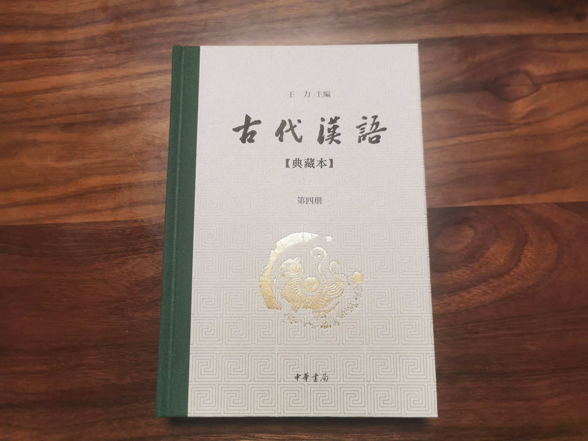
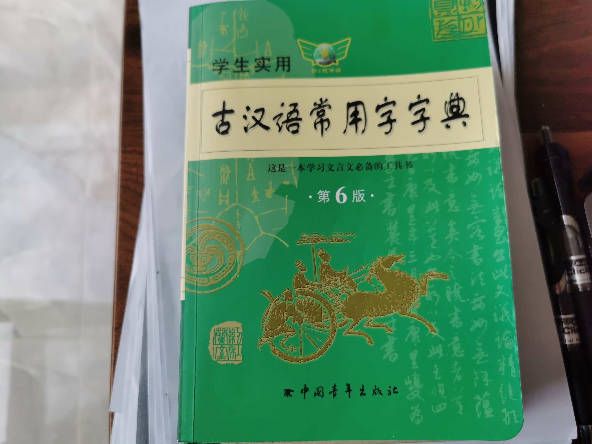
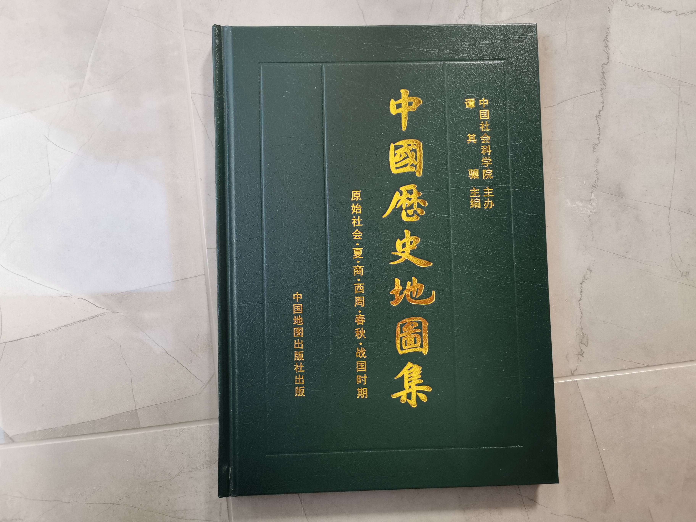

# 《古代汉语》读书笔记（序）

## 缘起

我一直苦于自己时常不能游刃有余地写作、表达。我认定这一切的根源就是还没有掌握古代汉语。

我当然也上过高中——文言文很难背诵，背诵了的也很快忘光光。但一些很常见的字词我也还记得意思和用法。

后来上大学的时候，我零零散散读过《屈原集校注》和《四书章句集注》，都不得其法。不过我身边一直带着不少古文的书，且很大一部分是繁体竖排版本。

去年秋天我搬了家之后，有了专门的读书场所，有一张大书桌、一面大书柜，硬件条件都好了。电脑游戏我玩着玩着觉得还是很无聊，能打发时间，但玩完了还是感觉空虚。于是读书的欲望终于渐长，想要择一门学问踏踏实实地学习，这其中古代汉语即是一个优先选项。

有时候我会翻一翻《古文观止》，感觉其注释过于简略，落后时代，不适合我这种初学者。而且《古文观止》的选篇不包含《论语》、《孟子》这种儒家经典，在我眼里并不是一部完备的古代汉语学习教材。

直到去年底，我偶然翻到了《学生实用：古汉语常用字字典》的附录，其中有一篇叫做《古代汉语学习方法与技巧》，提到了最为推荐的学习教材是王力所著的《古代汉语》。王力是著名语言学家，他的名字可是如雷贯耳。于是我迅速网购了一套精装本。读罢序言，我便知道这正是我苦苦寻找的**古汉语学习一本通**了！

## 《古代汉语》是一本怎样的书

我后来才知道的是，王力先生所编的《古代汉语》是当代大学中文系古汉语教材的发轫和范本。现如今几乎所有的古汉语大学本科教材都依从了王力所创的**文选-常用词-古代文化常识**这个三段式体例。

**《古代汉语》的完备性主要体现在它的课文选择上**。它一共包含14个单元，每个单元基本只包含一部或一种著作的内容。而这14个单元加在一起，便完整地包含了所有常见的文言文和诗文类型。

| 单元 | 课文选材来源 | 课文举例 |
| --- | --------------------------  | --------------------- |
| 一  | 《左传》                      | 《郑伯克段于鄢》        |
| 二  | 《战国策》                    | 《触龙说赵太后》         |
| 三  | 《论语》《礼记》               | 《学而》《苛政猛于虎》    |
| 四  | 《孟子》                      | 《寡人之于国也》         |
| 五  | 《墨子》《老子》《庄子》《荀子》等| 《北冥有鱼》《劝学》      |
| 六  | 《诗经》                      | 《氓》                 |
| 七  | 《楚辞》                      | 《离骚》               |
| 八  | 《史记》《汉书》                | 《淮阴侯列传》《霍光传》 |
| 九  | 两汉魏晋古文                   | 《陈情表》             |
| 十  | 唐宋八大家古文                 | 《醉翁亭记》            |
| 十一 | 南北朝至唐初骈文               | 《滕王阁序》            |
| 十二 | 赋                           | 《阿房宫赋》            |
| 十三 | 诗                           | 《黄鹤楼送孟浩然之广陵》  |
| 十四 | 词、曲                        | 《水调歌头》《山坡羊》   |

另外，在学习过程中，我深深感到王力先生作为教材编写者，切实地考虑了初学者的需求。举例如下：

1. **使用繁体字**。推敲文字不得不用繁体。众所周知，简化字简化的过程丢掉了不少文字演化的信息和不同字之间的关联信息。
2. **横排印刷**。摈弃常见古书的竖排。虽然我能读习惯竖排，但是效率还是远不如横排。我甚至认为所有当代出版的古文书都应该抛弃掉这个没有意义的传统。古时候人们写文章写成竖排大概是因为生产力和材料的限制。横排才应当更符合人的双眼为左右分布、横向视野更灵敏的特点。
3. **课文注释只取一种**。常见的古书校注、译注版本通常都会列出不止一种前人的解释，然后对比评判。作为教材，列出多种解释会大大增加篇幅，而且对初学者有可能不友好。
4. **注释使用汉语拼音注音**。汉语拼音无疑是一件伟大的发明，它要远远优于出现在它以前的注音方式（反切、注音字母等）。
5. 注释中有对语法的说明。比如会解释倒装句这种容易让人一头雾水的语法现象。
6. 注释只使用现代汉语，也会明确地标出有的字古今意思的不同。
7. 常用词的讲解，先讲本义，再讲引申义。也有同义词的对比和辨析。另外还会明确标出后起的意思——中古和上古的汉语还是有一些不同的。全书收录了1000个常用词，本身几乎可以当作古汉语词典使用了。（书末有检字表，所以这本书就是字典。）
8. **古汉语通论包含了完备的知识**。一方面包括了语法和文体、诗词曲韵的讲解，另外一方面还包含诸如礼法、天文、地理、官职、科举等等能帮助初学者读懂古文的常识。
9. **极为有价值的附录**。附录包含了许多内容都值得经常查阅。附录一为《简化字与繁体字对照表》。附录二为《汉字部首举例》，其中为常见的偏旁做了归类，并且说明其意义。附录三为《上古韵部及常用字归部表》。附录四为《上古声母及常用字归类表》。最震撼的是附录五《天文图》。它是一张北半球的星图，里面注明了主要星座的中西名称。如果不知道“星分翼轸”中的翼和轸是指什么，打开这张图一眼便知。剩下的附录六七八九，皆是诗词曲韵相关的知识，如常见词谱等。总而言之，这些知识在其他书籍和字典里很少见到，但又确实是一些能帮我们更好地读懂古汉语的必要知识。

## 我的《古代汉语》学习方法

这里仅仅是做个记录，并不是分享我的经验。毕竟可能少有人像我这样，理工科毕业很多年了，突然脑子一热开始学古汉语。

我的方法最大的优点就是能让我坚持下去，并且自得其乐。

前面提到，这个教材每个单元是由文选、常用词、古代文化常识三部分构成。最重要的毫无疑问就是文选部分。我深知学习语言最笨的办法就是最有效的办法，于是要求自己**能将课文一字不差地默写下来**。总结起来，每个单元我大概会做如下步骤：

1. 对于每一篇课文，先尝试不看注释理解课文。
2. 然后看看注释，尝试一段一段翻译出来。
3. 尝试将第2步的译文段落回译为古文，并对照课文看看哪里错了。
4. 将课文段落默写出来，并对照课文看看哪里错了。
5. 马上再默写一遍。
6. 一旦这篇课文所有段落都默写过了，就全文默写一遍。
7. 在随后几日利用闲暇时间在手机记事本上用手写输入法来默写课文，通常一天不会把一篇课文默写超过一次。并且将错误处高亮出来。
8. 在不想读课文或者不想默写课文的时候，便阅读古汉语常识部分。
9. 所有课文默写完之后，阅读常用词部分。
10. 尝试将整个单元所有课文在几个小时内从头到尾全部默写出来。
11. 在整个单元默写基本不出错之后，将疑点和思考记录下来，写成一个单元的读书笔记。

自从学习古代汉语之后，我在手头没事的时候也还是经常刷手机。只不过别人可能刷抖音，而我在对着一个记事本软件奋笔疾书。只是后来，我又发现光是靠不断地默写来加深记忆效率有些低，于是我在已经能默写课文之后，又找到别人朗读的课文跟读与背诵，从而达到复习的目的。用一遍默写需要的时间，我大约能跟读或者背诵七八遍了，复习的效率大大得到了提升。

我所跟读的是喜马拉雅App上*白云出岫*的朗读作品。他的作品读音比较准确，这能让我校准我对某些字读音的认识。但遗憾的是，他的作品仍然有不少肯定错误的地方，只是作为免费作品，我也没啥好挑剔的了。

此外，工欲善其事，必先利其器。买工具书我也是毫不吝啬的。

辞书方面除了本来就在手的《学生实用：古汉语常用字字典》和《尔雅》，还购买了中华书局的三全本《说文解字》和商务印书馆的《古代汉语词典（第二版）》。

另外许多古书如《左传》、《战国策》、《史记》等等里头提到的地名也会非常多，我又买了一套《中国历史地图集》作为参考。

## 各单元读书笔记

学习《古代汉语》的课文的时候，我总会有一些地方理解不了。这个时候光靠教材和字典来寻找答案经常会不太够。我参阅了其他版本对有疑问之处进行挖掘、考较，最终就整理出来了一些笔记。面对许多问题，其实我至今仍然没有得到让自己满意的答案。只不过写下这些笔记的过程也顺便让我整理了一下思路。

这些读书笔记也不是一蹴而就的，而是初次写完之后又随着我不断地学习而更新的。

为了增强可读性，保证叙述的完整性，我会将所选课文的原文尽数摘抄在读书笔记中；并且每一段以【#】开头，#是阿拉伯数字，表示这是摘抄了原文的第#段。

链接列于下：

- [第一单元读书笔记](./Unit1/readme.md)
- [第二单元读书笔记](./Unit2/readme.md)